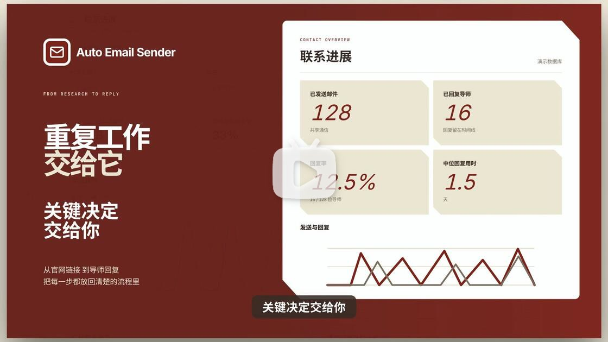
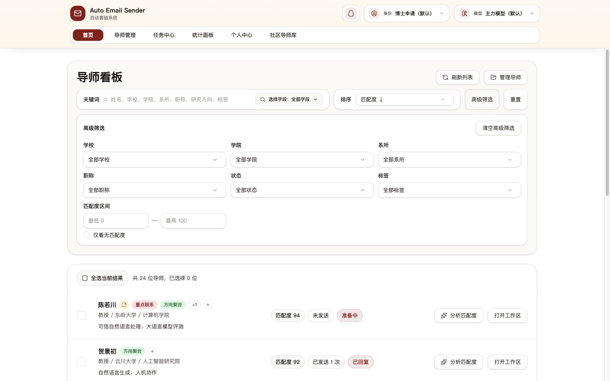
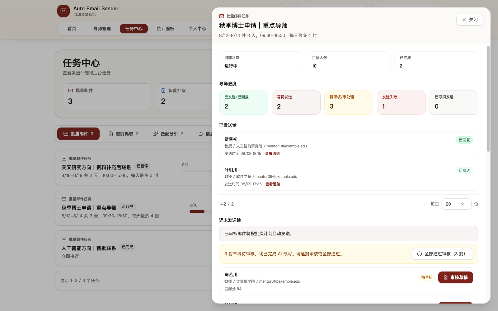
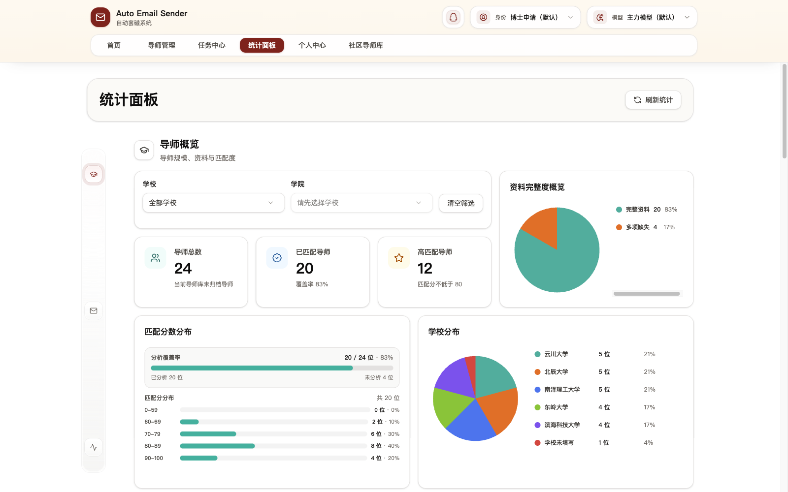
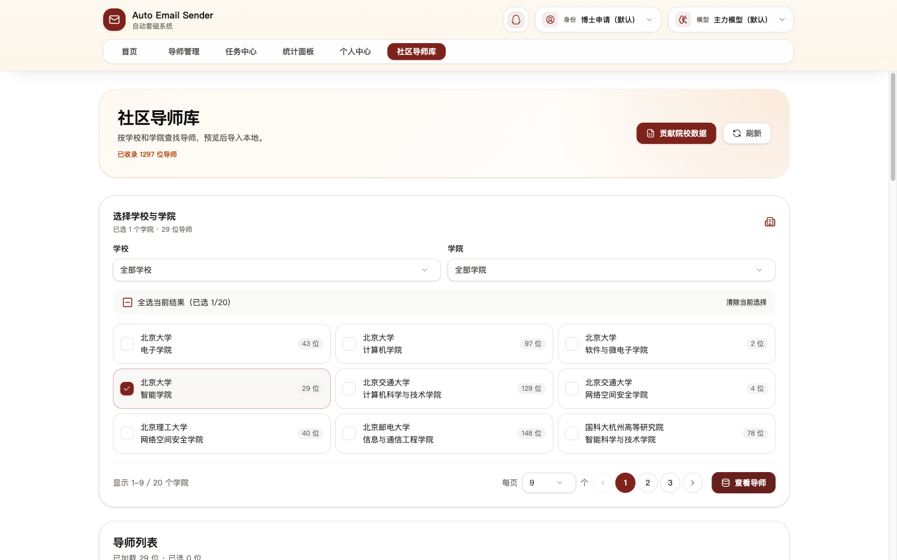

  
  <h1>Auto Email Sender</h1>
  

    <strong>面向导师套磁场景的智能邮件助手</strong>
  

  

    
    
    
    
  

---

> 利用 Agent 从学校导师页智能抓取导师信息，结合 LLM 分析匹配度，完成模板改写、定时批量发送和回复追踪。

Auto Email Sender 是一个本地运行的导师联系工具。从导师抓取、匹配分析、邮件草稿生成，到定时批量发送和回复追踪，整个流程在一个应用内完成。适合需要批量联系导师、又不想无脑群发的场景。

系统替你完成信息整理和重复写信的工作，但最终发给谁、什么时候发、发什么内容，仍然由你来定。

## 宣传片

  

  <a href="https://www.bilibili.com/video/BV1yQgw6rEXG">在哔哩哔哩观看宣传片</a>

## 界面预览

| 导师看板 | 批量草稿审核 |
| --- | --- |
|  |  |

| 统计面板 | 社区导师库 |
| --- | --- |
|  |  |

## 入口

- [官网](https://juniexd.github.io/AutoEmailSender/)
- [文档](https://juniexd.github.io/AutoEmailSender/docs/getting-started)
- [导师抓取 Skill](https://juniexd.github.io/AutoEmailSender/docs/mentor-crawler-skill)
- [下载桌面版](https://github.com/JunieXD/AutoEmailSender/releases)
- [问题反馈](https://github.com/JunieXD/AutoEmailSender/issues)
- QQ 交流群：`952383261`

## 交流与反馈

欢迎加入 QQ 交流群反馈 Bug、提出功能建议，或和其他同学交流使用经验。

  

如果需要提交可追踪的问题、复现步骤或截图，也可以前往 [GitHub Issues](https://github.com/JunieXD/AutoEmailSender/issues)。

## 核心特点

| 特点         | 说明                                                     |
| ------------ | -------------------------------------------------------- |
| 智能抓取     | Agent 从学校官网整理导师信息，减少手动复制和表格维护     |
| 社区导师库   | 浏览并导入已整理的公开导师资料，导入前可处理资料冲突     |
| 匹配度分析   | LLM 结合你的材料和导师资料，辅助判断联系优先级           |
| 导师标签     | 自定义标签标记和筛选导师，支持导入导出时携带标签         |
| 草稿审核     | 批量生成后逐封检查，也可套用模板或批准全部待审核草稿     |
| 发送计划     | 集中管理定时邮件，支持改期、取消、恢复和立即发送         |
| 回复追踪     | IMAP 自动检测导师回复，标记联系状态，方便后续跟进        |
| Agent 支持   | 可选用本地命令行和 Agent 查询、筛选并管理任务             |

## License

GPL-3.0

## Star History

<a href="https://www.star-history.com/">
 <picture>
   <source media="(prefers-color-scheme: dark)" srcset="https://api.star-history.com/chart?repos=JunieXD/AutoEmailSender&type=date&theme=dark&legend=top-left&sealed_token=xQN4NTyRjKuKYpjssLWpx_McJlHJe9s0mXmYmQNRrHYQxlq42KhQO8eOJoQTOoUvzxupHrY21TS9FVPsvpIRGboRX2_YEJ7DzXwvpVVDQWNGST4xKVGTSRCCMgPgJJ3i5MKjSv6LLZhC3-TQqfFZNUIdsvwZpaFvtoPPcjEaA19zdgH55LvDIyaOQyJ-" />
   <source media="(prefers-color-scheme: light)" srcset="https://api.star-history.com/chart?repos=JunieXD/AutoEmailSender&type=date&legend=top-left&sealed_token=xQN4NTyRjKuKYpjssLWpx_McJlHJe9s0mXmYmQNRrHYQxlq42KhQO8eOJoQTOoUvzxupHrY21TS9FVPsvpIRGboRX2_YEJ7DzXwvpVVDQWNGST4xKVGTSRCCMgPgJJ3i5MKjSv6LLZhC3-TQqfFZNUIdsvwZpaFvtoPPcjEaA19zdgH55LvDIyaOQyJ-" />
   
 </picture>
</a>
