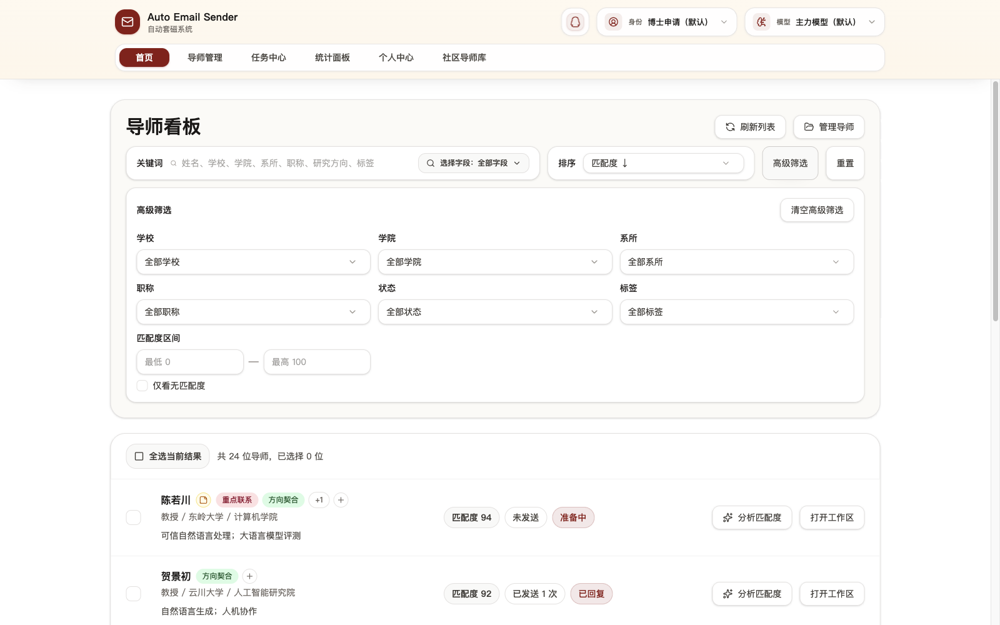
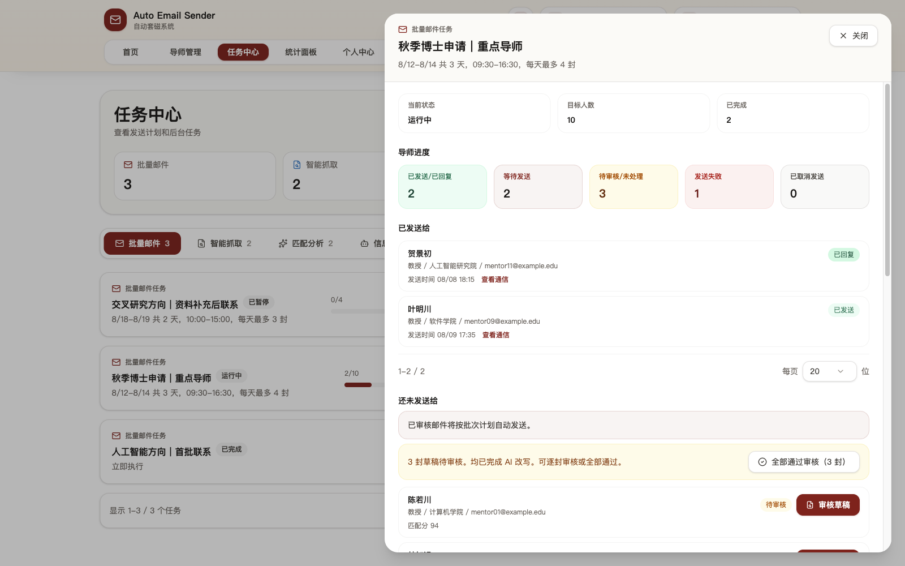
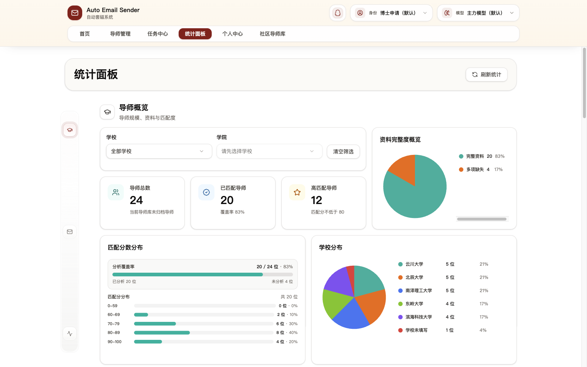
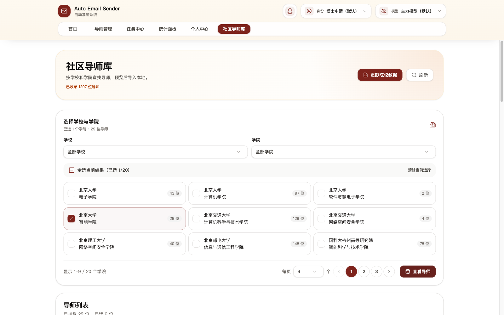

  
  <h1>Auto Email Sender</h1>
  

    <strong>面向导师套磁场景的智能邮件助手</strong>
  

  

    
    
    
    
    
  

---

> 利用 Agent 从学校导师页智能抓取导师信息，结合 LLM 分析匹配度，完成模板改写、定时批量发送和回复追踪。

Auto Email Sender 是一个本地运行的导师联系工具。从导师抓取、匹配分析、邮件草稿生成，到定时批量发送和回复追踪，整个流程在一个应用内完成。适合要联系很多位导师、又不想群发模板的同学。

整理信息和重复写信的活交给工具，发给谁、什么时候发、发什么内容，由你自己决定。

## 宣传片

  

  <a href="https://www.bilibili.com/video/BV1sUHS6uEUZ">在哔哩哔哩观看宣传片</a>

## 界面预览

| 导师看板 | 批量草稿审核 |
| --- | --- |
|  |  |

| 统计面板 | 社区导师库 |
| --- | --- |
|  |  |

## 入口

- [官网](https://juniexd.github.io/AutoEmailSender/)
- [文档](https://juniexd.github.io/AutoEmailSender/docs/getting-started)
- [导师抓取 Skill](https://juniexd.github.io/AutoEmailSender/docs/mentor-crawler-skill)
- [下载桌面版](https://github.com/JunieXD/AutoEmailSender/releases)
- [问题反馈](https://github.com/JunieXD/AutoEmailSender/issues)
- QQ 交流群：`952383261`

## 交流与反馈

欢迎加入 QQ 交流群反馈 Bug、提出功能建议，或和其他同学交流使用经验。

  

如果需要提交可追踪的问题、复现步骤或截图，也可以前往 [GitHub Issues](https://github.com/JunieXD/AutoEmailSender/issues)。

## 核心特点

从整理导师资料到追踪回复，联系导师的整个流程都包含在内。邮件发出前，一定会经过你的审核和确认。

### 导师资料

- **智能抓取：** 从学校官网整理邮箱、院系、研究方向、近期论文和主页链接，抓取结果要经你审核，才会进入导师库。
- **社区导师库：** 浏览并导入已整理的公开导师资料，导入前可预览差异和处理冲突。

### 匹配与写信

- **匹配度分析：** 结合个人材料、意向研究方向和导师近期研究，给出匹配理由和联系建议。
- **AI 个性化改写：** 结合导师资料、邮件模板和你选定的参考材料生成草稿，语气、长度和保留多少模板原文都可以调整。

### 审核与发送

- **草稿审核：** 批量生成后可以逐封修改、重新改写或批准，AI 写的草稿不会自动发出。
- **发送计划：** 可以立即发送，也可以按日期、时段和每次数量定时发送；单封邮件还能改期、取消或恢复。

### 跟进与协作

- **回复追踪：** 通过 IMAP 同步已发送邮件和导师回复，自动更新任务状态，并保留往来记录。
- **Agent 支持：** 可通过本地命令行让 Agent 查询导师、筛选数据、管理任务；涉及发送的操作仍需你确认。

## License

GPL-3.0

## Star History

<a href="https://www.star-history.com/">
 <picture>
   <source media="(prefers-color-scheme: dark)" srcset="https://api.star-history.com/chart?repos=JunieXD/AutoEmailSender&type=date&theme=dark&legend=top-left&sealed_token=xQN4NTyRjKuKYpjssLWpx_McJlHJe9s0mXmYmQNRrHYQxlq42KhQO8eOJoQTOoUvzxupHrY21TS9FVPsvpIRGboRX2_YEJ7DzXwvpVVDQWNGST4xKVGTSRCCMgPgJJ3i5MKjSv6LLZhC3-TQqfFZNUIdsvwZpaFvtoPPcjEaA19zdgH55LvDIyaOQyJ-" />
   <source media="(prefers-color-scheme: light)" srcset="https://api.star-history.com/chart?repos=JunieXD/AutoEmailSender&type=date&legend=top-left&sealed_token=xQN4NTyRjKuKYpjssLWpx_McJlHJe9s0mXmYmQNRrHYQxlq42KhQO8eOJoQTOoUvzxupHrY21TS9FVPsvpIRGboRX2_YEJ7DzXwvpVVDQWNGST4xKVGTSRCCMgPgJJ3i5MKjSv6LLZhC3-TQqfFZNUIdsvwZpaFvtoPPcjEaA19zdgH55LvDIyaOQyJ-" />
   
 </picture>
</a>
