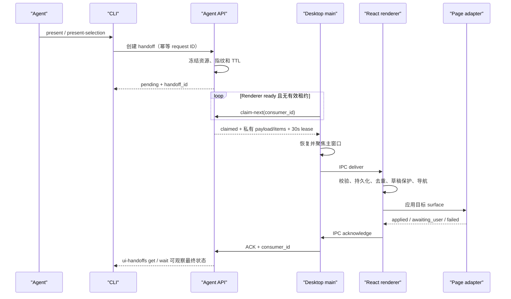

# Agent UI handoff 架构

- 状态：已实现
- 日期：2026-08-10
- 所有者：Agent API、Desktop 主进程、Frontend 页面适配器

## 目标与边界

UI handoff 让 Agent 把一个已经解析并冻结的业务对象集合交给桌面界面，例如“在导师管理页勾选这些导师”或“打开这封草稿”。它只改变短期界面状态，不归档、不编辑、不创建草稿、不发送邮件，也不代替需要确认的业务计划。

协议遵守以下不变量：

1. CLI 只提交类型化资源 ID、受控筛选和目标 surface，不能提交任意路由、脚本或前端状态。
2. 后端在创建时冻结精确资源，并以 `handoff_id`、选择指纹和有序 item 保存；后续数据变化不会扩大范围。
3. Desktop 使用短租约领取，Electron IPC 至少一次投递；Renderer 必须按 `handoff_id` 去重并持久化待发送 ACK。
4. 页面适配器只有在目标身份、路由和响应对象均匹配时才能返回 `applied`。
5. 工作区存在未保存草稿时，导航必须经过同一 draft guard；用户拒绝后返回 `awaiting_user`，不能覆盖当前编辑。

## 端到端链路

创建响应不包含页面私有 payload 或冻结 ID；这些字段只在成功领取后交给 Desktop。领取租约到期而未 ACK 时，后端把记录恢复为 `pending`，允许再次投递。Renderer 在 sessionStorage 中同时保存 handoff 与 ACK，因此刷新窗口不会重复应用已经完成的页面动作。

Preload 在 React 订阅建立前最多缓冲当前领取项，并在 StrictMode 的“订阅 → 清理 → 重新订阅”周期中把它交给仍然有效的订阅者。Desktop 主进程还会保留领取请求与页面重载并发时返回的 claim；新 Renderer 就绪后先重投同一 claim，而不是等待 30 秒租约失效。

## 状态模型

| 状态 | 含义 | 后续动作 |
|---|---|---|
| `pending` | 等待一个已就绪的桌面窗口领取 | read、wait、cancel |
| `claimed` | 已被指定 `consumer_id` 持有短租约 | read、wait、cancel、ACK |
| `awaiting_user` | 草稿保护或页面交互需要用户决定 | read、retry、cancel |
| `applied` | 页面已定位并应用临时状态 | read |
| `failed` | 校验、上下文或页面适配失败 | read、retry |
| `canceled` / `expired` | 不再投递 | read |

默认 handoff TTL 为 30 分钟，领取租约为 30 秒；`applied` 后把可读取期限延长到 8 小时。导师选择最多冻结 10,000 项，ACK 的结构化结果最多 16 KiB。

`cancel`、`retry` 和 ACK 都使用“handoff ID + 旧状态 + 未过期 + consumer（ACK）”条件更新。并发竞争只有一个权威赢家；失败的一方读取最新状态并返回冲突，不能用较晚提交静默覆盖已经发生的取消、重试或 ACK。Desktop 遇到 ACK 409 时读取后端权威状态，Renderer 若发现状态已经不同，会停止重试旧回执并移除本地记录。

CLI 的 `ui-handoffs wait` 返回 `condition_met`、`timed_out`、`settled` 和 `terminal`。`--until applied` 遇到 `failed`、`canceled` 或 `expired` 会立即返回 `condition_met: false` 和 warning，不会继续空等到超时；`awaiting_user` 仍可由用户处理后继续，因此只在 `--until settled` 时作为停止条件。

## Surface 合同

| Surface | 固定路由 | 上下文与页面行为 |
|---|---|---|
| `professors.management` | `/professors` | replace/add 勾选；可仅显示冻结集合；支持 active、archived 或混合范围 |
| `professors.home` | `/` | 绑定 `identity_id`；只允许未归档导师；在首页看板勾选 |
| `tasks.center` | `/tasks` | 切到发送计划并精确定位 `task_id` |
| `crawler.job` | `/tasks` | 切到后台任务/抓取；自动选择当前或回收站视图并打开详情 |
| `communications.thread` | `/workspace/:professor_id` | presentation-only 读取通信线程，不调用 `ensureWorkspaceTask` |
| `draft.workspace` | `/workspace/:professor_id` | 以 `task_id` 精确加载草稿并展开编辑区 |

导师页面使用 `ui_handoff_id` 服务端分页，不能把完整 ID 列表重新塞进 URL 或前端筛选。后端同时校验目标 surface；首页还校验查询身份与冻结身份一致。

## 前端持久化与草稿保护

- `agent_ui_handoffs_v1` 保存有序 handoff 队列及待重试 ACK；损坏或重复缓存整体丢弃。
- Provider 一次只处理队首，先检查过期、身份和 draft guard，再导航并调用已注册 surface handler；通信线程或草稿即使仍在同一路由，只要工作区上下文会改变，也必须经过 draft guard。
- ACK 失败采用有上限的指数退避；ACK 成功后才移除本地记录并显示成功通知。若交接或 ACK 重试期间过期，或后端已经进入其他权威状态，则丢弃本地记录并停止旧重试。
- 页面选择 banner 区分 Agent 本次选择数与页面总选择数，并提供退出仅看已选、撤销 Agent 选择和清除全部选择；selected-only 的临时筛选不会覆盖用户原先持久化的页面偏好。
- 导师 selected-only 页面在返回 `applied` 前核对服务端实际总数与冻结数量；导师已删除、归档范围变化或身份不匹配导致缺项时，回滚选择、筛选、排序、页码和高级筛选展开状态。
- 普通页面间的 CreateTask 预填使用独立的 `app_navigation_handoff_v1` 原子记录；它不是 Agent UI handoff，也不经过后端租约。

## 扩展新 Surface

新增 surface 必须同时完成：

1. 后端创建入口、冻结资源、固定 route、payload schema、幂等与生命周期测试。
2. CLI capability、`describe` 合同、风险/效果、意图别名和可执行 action link。
3. Desktop IPC 联合类型、主进程解析白名单、preload bridge 与投递测试。
4. Frontend 严格运行时校验、身份解析、页面 handler、响应对象交叉校验和 ACK 结果。
5. 覆盖过期、重复投递、租约恢复、刷新恢复、草稿拒绝、目标已删除/归档和应用不可用场景。

任何需要修改业务数据或调用外部服务的动作都不能隐藏在页面 handler 中；应继续使用现有写命令、确认计划或后台任务合同。
