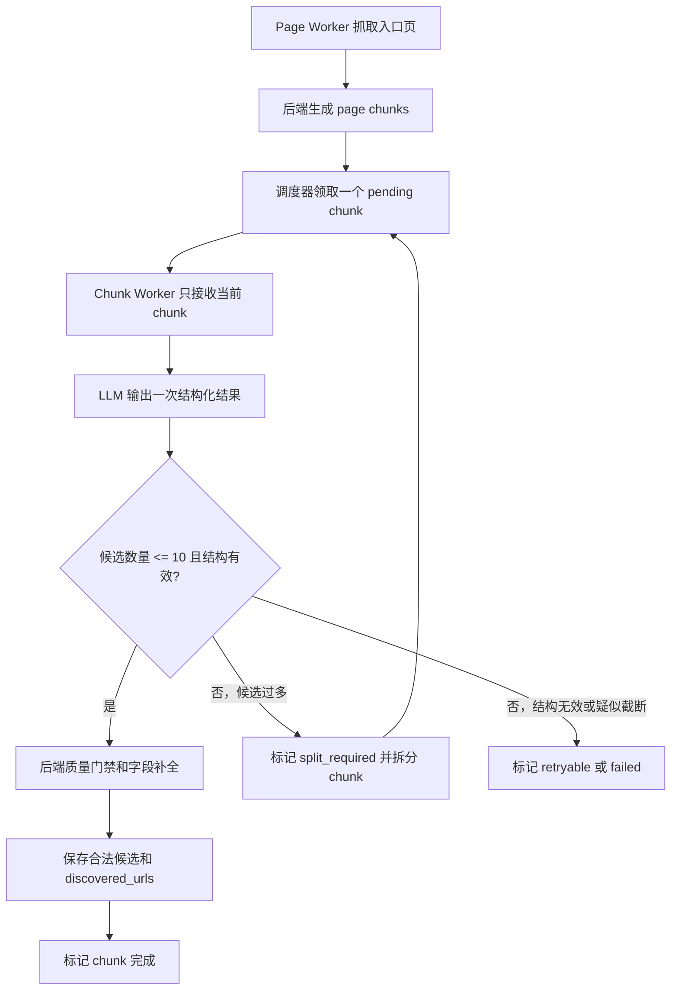

# Crawler V2 迁移 V1 候选发现机制规格

## 背景

Crawler V2 已切换为「数据库调度器 + 短生命周期 Worker」架构。这个方向是正确的：Page Worker 只抓页面并生成 chunk，Chunk Worker 只处理当前 chunk，后续流程由调度器根据数据库状态推进。

最近一次抓取暴露出新的问题：Chunk Worker 对一个较大的教师名录 chunk 一次性输出并保存了 84 位候选。候选全部只有姓名，没有邮箱，也没有详情页链接，导致后续补全全部失败。该问题说明 V2 虽然避免了长对话历史，但丢掉了 V1 中用于控制输出长度、候选质量和保存安全的机制。

本规格定义：哪些 V1 机制必须迁移到 V2，哪些不能迁移，以及 V2 最终应如何处理 chunk、候选保存和 URL 发现。

## 核心原则

所有节省 token 的优化都不能对正常功能流程造成风险或负面影响。

因此，本次迁移必须遵守以下原则：

- 不为了省 token 接受低质量候选。
- 不为了省 token 跳过详情页链接、邮箱等关键字段。
- 不让 LLM 一次输出过大的候选数组，避免 JSON 截断或字段丢失。
- 不恢复 V1 长 Agent 的历史对话模式。
- 不恢复 Page Worker 自动发现链接。
- 后端保存规则必须比 LLM 输出更可信。

## V1 需要迁移的机制

### 单次候选数量上限

V1 要求每次 `submit_page_chunk_candidates` 最多提交 10 个候选。这个限制的目的不是产品分页，而是避免工具参数过长、JSON 被截断、字段丢失或模型在长输出中开始偷懒。

V2 必须保留这个规则：

- 一个 Chunk Worker 单次结构化结果最多允许 10 个候选。
- 如果 LLM 返回超过 10 个候选，后端不能保存前 10 个后静默丢弃其余候选。
- 超过 10 个候选应视为当前 chunk 过大，触发拆分或重试策略。

### 候选质量门禁

V1 的批量保存会拒收「缺邮箱且缺详情页链接」的候选，因为这类候选既无法直接联系，也无法进入详情页补全。

V2 必须迁移该门禁：

- 候选缺少 `email` 且缺少 `profile_url` 时，不得写入 `crawl_candidates`。
- 被拒收的候选需要计入 rejected 统计，并记录原因。
- 如果一个 chunk 的候选全部被拒收，chunk 不能简单标记为成功提取大量候选；应保留可诊断状态，便于判断是模型提取质量问题还是页面内容问题。

### 详情页链接保存规则

V1 明确要求：第一轮发现阶段看到导师个人详情页链接时，只保存为 `profile_url`，不要进入详情页抓取。

V2 必须迁移该规则：

- chunk 内容中的 Markdown 链接形如 `[导师名](https://...)`，且锚文本与候选姓名匹配时，LLM 必须把链接写入该候选的 `profile_url`。
- LLM 未写入时，后端可以基于当前 chunk 文本做确定性补全：从与姓名匹配的 Markdown 链接中填充 `profile_url`。
- 详情页链接不应进入 `discovered_urls` 作为新页面抓取任务；它属于候选字段，不属于列表页发现。

### 字段约束和证据约束

V1 prompt 包含较完整的字段约束，V2 需要迁移其中与质量相关的部分：

- 候选字段必须使用英文键：`name`、`email`、`title`、`university`、`school`、`department`、`research_direction`、`recent_papers`、`profile_url`、`source_url`、`confidence`、`field_confidence`、`evidence`。
- `confidence` 和 `field_confidence` 必须是 0 到 1 的数字。
- 字段值保持页面原文语言，不翻译、不音译、不拼音化。
- 不伪造缺失字段；无法确认的信息保持为空。
- `evidence` 保持简短，只保存必要摘要，不复制大段页面原文。
- 候选必须来自当前 chunk 内部明确证据，不依赖历史记忆。

### chunk 过大处理机制

V1 有 `too_many_candidates` 机制：当当前 chunk 内明确超过 10 个已看见候选时，后端拆分当前 chunk，后续处理子 chunk。

V2 应采用相同思想，但交互方式不同：

- Chunk Worker 仍然只处理一个 chunk。
- Chunk Worker 仍然只输出一次结构化结果。
- 如果当前 chunk 候选超过 10 个，结果应标记为 `split_required`，并且不保存超量候选。
- 后端将父 chunk 标记为 `split_required` 或 `superseded`，生成更小的子 chunk。
- 调度器后续领取子 chunk，直到每个 chunk 可在一次输出中稳定给出不超过 10 个候选。

### 截断和无效结构处理

V1 能识别 `submit_page_chunk_candidates` 因输出过长而截断。V2 也必须有等价处理：

- JSON 解析失败，不能标记 chunk 完成。
- 结构化字段缺失，不能标记 chunk 完成。
- 候选数量超过上限，不能按成功保存处理。
- 输出疑似被截断时，chunk 应进入可重试或拆分状态。
- 重试超过预算后，chunk 标记为失败，并保留错误原因。

## V2 不应迁移的 V1 机制

以下 V1 机制不适合迁移到 V2：

- 不迁移长生命周期 DeepAgent 对话。
- 不迁移「保存结果返回下一步指令，模型继续决定流程」的模式。
- 不迁移同一个 Agent 内多次 `submit_page_chunk_candidates` 分批保存的交互方式。
- 不迁移 Page Worker 自动扫描页面 links 并入队的逻辑。
- 不允许 Chunk Worker 调用 `crawl_page` 或浏览器工具。
- 不让 Worker 根据历史对话判断任务是否完成。

V2 的下一步由数据库调度器决定，不由 Chunk Worker 根据工具返回结果继续对话。

## V2 目标流程

### 正常流程



### 保存成功条件

一个 chunk 只有满足以下条件，才可标记为完成：

- LLM 结构化结果可解析。
- `chunk_status` 合法。
- 候选数量不超过 10。
- 每个候选通过字段校验。
- 合法候选已保存或合并。
- 合法 `discovered_urls` 已完成幂等入队。
- 无邮箱且无详情页链接的候选已被拒收并记录。

### 拆分条件

以下情况应触发 chunk 拆分：

- LLM 明确返回 `split_required`。
- LLM 返回候选数量超过 10。
- LLM 输出疑似因候选过多而截断。
- 后端根据 chunk 内容的确定性规则发现候选链接密度明显过高，且当前 chunk 已达到可拆分条件。

如果 chunk 已达到最大拆分深度，不能无限拆分，应标记为失败并保留错误原因。

## Chunk Worker 输出协议

V2 Chunk Worker 仍然输出一个 JSON 对象，但必须更严格。

字段：

```json
{
  "chunk_status": "completed | no_candidates | split_required",
  "candidates": [],
  "discovered_urls": []
}
```

约束：

- `candidates` 最多 10 个。
- `chunk_status=completed` 时，表示当前 chunk 中可提交候选已完整提交，且数量不超过 10。
- `chunk_status=no_candidates` 时，`candidates` 必须为空。
- `chunk_status=split_required` 时，后端不保存候选，优先拆分当前 chunk。
- `discovered_urls` 只用于候选列表页、分页页、教师目录页等继续抓取入口。
- 导师个人主页链接必须放入候选的 `profile_url`，不能放入 `discovered_urls`。

## 后端保存协议

V2 保存候选不应继续手写独立逻辑。应抽取或复用 V1 保存能力，形成共同的候选保存服务。

保存服务必须提供：

- 字段标准化。
- 邮箱规范化。
- `profile_url` 规范化。
- 缺邮箱且缺详情页链接拒收。
- 候选去重。
- 候选合并。
- `identity_key` 生成。
- `field_sources` 生成。
- rejected/merged/saved/skipped 统计。

V2 只负责把当前 chunk 的候选转换为带 `source_chunk_id` 和 `source_kind` 的候选输入，然后交给统一保存服务。

## URL 发现协议

V2 已取消 Page Worker 自动发现 URL，该方向保持不变。

URL 来源只能有两类：

1. 任务入口 URL。
2. Chunk Worker 在当前 chunk 中明确发现的 `discovered_urls`。

`discovered_urls` 只允许保存候选列表页、分页页、目录页等继续抓取入口。导师个人详情页不进入 page task，只保存为候选的 `profile_url`。

后端必须对 `discovered_urls` 做以下校验：

- URL 规范化。
- 同域或允许域判断。
- 去重。
- 已完成、无需再处理、terminal failed 的页面不重复入队。
- 邮箱、`javascript:`、`mailto:`、HTML 片段等非法 URL 拒绝入队。

## 前端监控预期

V2 不再保证「每 10 位候选实时出现一次」。如果 chunk 正常且候选数量不超过 10，前端会在该 chunk 完成后看到最多 10 位新增候选。

如果一个页面包含大量候选，正确表现应是：

- 初始大 chunk 触发拆分，不保存候选。
- 子 chunk 逐个处理。
- 前端随着子 chunk 完成，分批看到候选。
- 不应再出现一个 chunk 一次性保存几十位候选的情况。

## 验收标准

### 数据质量

- 无邮箱且无 `profile_url` 的候选不会进入 `crawl_candidates`。
- Markdown 导师链接能写入对应候选的 `profile_url`。
- 候选字段保持页面原文语言，不出现无依据翻译或拼音化。
- `confidence` 和 `field_confidence` 均在 0 到 1 范围内。

### 输出长度

- 单个 Chunk Worker 结果最多保存 10 位候选。
- 返回超过 10 位候选时，不保存部分结果，必须触发拆分或失败处理。
- JSON 解析失败或疑似截断时，chunk 不会被标记为完成。

### 流程稳定性

- Page Worker 不自动入队页面 links。
- Chunk Worker 不抓页面、不调用浏览器、不依赖历史对话。
- 调度器能继续处理拆分后的子 chunk。
- 任务结束判断仍以数据库 pending、processing、retryable 工作项为准。

### 兼容性

- V1 代码保留，不改变现有 V1 行为。
- V2 复用候选保存规则时，不能破坏 V1 保存结果。
- 旧任务数据只读展示，不强制迁移或清洗。

## 非目标

本规格不要求：

- 恢复 V1 长 Agent。
- 让 Chunk Worker 多轮分批调用保存工具。
- 让保存结果返回给 Chunk Worker 后继续决策。
- 让 Page Worker 重新发现 URL。
- 自动补全所有缺失字段。
- 清洗历史已经生成的低质量候选。

## 待实现要点

后续实现计划应覆盖：

1. 补充 V2 Chunk Worker prompt，使其继承 V1 字段和质量约束。
2. 为 V2 增加候选数量上限校验。
3. 将 V1 候选保存规则抽取为 V1/V2 共用服务。
4. 为 `profile_url` 增加基于当前 chunk Markdown 链接的确定性补全。
5. 实现 V2 chunk 超量拆分或复用现有拆分能力。
6. 增加 JSON 截断、解析失败、超量候选的 retry/failed 状态处理。
7. 修正手动补全入口，避免无 `profile_url` 候选被当成失败补全任务执行。
8. 补充覆盖上述行为的 V2 回归测试。