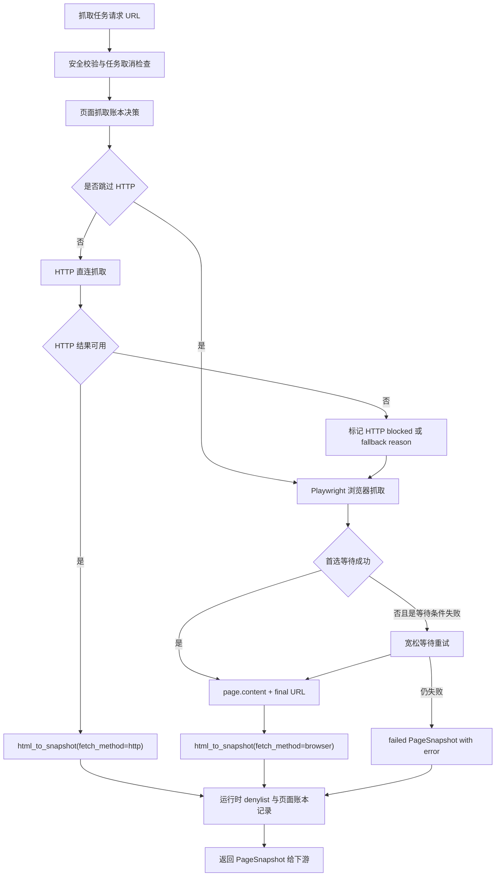

# 抓取依赖瘦身设计

## 背景

当前 Windows 桌面包需要内置后端、前端资源和 Playwright Chromium headless shell。Chromium 体积最大，但近期验证显示北邮计算机学院页面依赖真实 Chromium 能力，尤其需要浏览器启动参数 `--disable-blink-features=AutomationControlled` 才能稳定拿到页面。因此本轮不再尝试用 obscura 替代 Chromium，也不移除 Playwright。

现有抓取链路中，Crawl4AI 主要承担浏览器抓取包装职责：HTTP 直连失败或页面疑似未渲染时，进入 Crawl4AI 的浏览器模式拿到渲染后的 HTML，再交给项目内的 `html_to_snapshot()` 转成 `PageSnapshot`。导师页面抽取、链接收集、正文清洗和失败记录都已经在项目自身代码中完成，Crawl4AI 并不是当前业务链路的核心抽取器。

依赖调查发现：

- `crawl4ai` 会带入 `patchright`、`playwright-stealth`、`numpy`、`scipy`、`shapely`、`rtree`、`trimesh`、`nltk`、`unclecode-litellm` 等大量间接依赖。
- `browser-use` 当前在 `backend/app` 没有实际业务 import，但会带入多家模型 SDK、MCP、PDF、报表等不需要的依赖。
- `cloudscraper` 和 `pandas` 当前在 `backend/app` 没有实际业务 import。
- `markitdown[pdf]` 也偏重，但它服务材料上传后的文本提取，不属于导师页面抓取链路，和本轮风险边界不同。

## 目标

- 保留 Playwright 和内置 Chromium，确保当前智能抓取能力不下降。
- 移除 Crawl4AI，并用项目内最小 Playwright browser fetch 后端替代它的浏览器抓取包装职责。
- 移除当前未使用的 `browser-use`、`cloudscraper`、`pandas` 依赖。
- 保持 `PageSnapshot` 的字段、语义和下游调用行为兼容。
- 保持 Windows 桌面包作为主要交付目标；Linux 继续作为开发和验证环境。
- 清理打包脚本中不再需要的 Crawl4AI、Patchright、browser-use 相关收集或排除配置。
- 更新测试、文档、错误信息中的 Crawl4AI 命名，避免新实现继续带旧概念。

## 非目标

- 不移除 Playwright。
- 不移除 Chromium headless shell。
- 不重新评估 obscura。
- 不在本轮移除或替换 `markitdown[pdf]`。
- 不改变智能抓取的数据库模型、任务调度模型、候选导师保存模型和 LLM 补全流程。
- 不引入站点级浏览器策略配置后台。
- 不追求对所有强反爬页面的通用绕过，只保持现有可抓页面能力不退化。

## 推荐方案

采用“保留 Chromium，去掉 Crawl4AI 壳层”的方案。

新的抓取后端直接使用 Playwright：

1. HTTP 直连仍作为首选路径。
2. 当 HTTP 结果为空、疑似阻断、疑似未渲染、命中浏览器优先策略或页面意图要求时，进入浏览器抓取。
3. 浏览器抓取启动项目内置 Chromium headless shell。
4. 浏览器上下文设置当前已有的 User-Agent、等待策略、超时、延迟返回、失败重试和 Chromium extra args。
5. 拿到 `page.content()` 与最终 URL 后，继续调用 `html_to_snapshot(final_url, html, "browser")`。
6. 下游继续按现有 `PageSnapshot`、页面账本、任务重试和失败机制处理。

这样做能移除 Crawl4AI 的依赖树，同时保留真正需要的浏览器能力。

## 保留行为

新 Playwright 后端必须显式保留以下现有行为：

- 使用内置 Playwright Chromium，而不是系统浏览器。
- 保持 `--disable-blink-features=AutomationControlled` 等现有浏览器启动参数，北邮页面依赖该能力。
- 继续使用 Windows 风格 User-Agent。
- 继续按页面意图选择等待策略：
  - `generic`：普通页面。
  - `directory`：导师列表页。
  - `profile`：导师详情页。
- 继续使用 `load` 作为默认页面加载等待，不把 `networkidle` 作为硬门槛。
- 等待条件失败时，执行一次更宽松的降级重试。
- 浏览器抓取失败时返回 failed `PageSnapshot`，并保留具体错误原因。
- 对渲染后 HTML 仍统一走 `html_to_snapshot()`，保持文本、链接、标题和 `suspicious_empty` 语义一致。
- 继续支持 Windows 事件循环兼容逻辑，必要时在线程内使用合适的 event loop 跑浏览器抓取。
- 继续走现有任务取消检查、页面抓取账本、URL 安全校验、运行时 URL denylist、任务内 HTTP blocked host 记忆和缓存策略。

## 代码结构

建议把 Crawl4AI 命名整体替换掉，而不是保留旧函数名。

### `backend/app/services/crawler_tools.py`

职责继续是抓取工具层，但命名从 Crawl4AI 迁移到 browser fetch：

- 将 `crawl_page_with_crawl4ai()` 改为 `crawl_page()` 或 `crawl_page_with_browser_fallback()`。
- 将 `_crawl_page_with_crawl4ai_browser()` 改为 `_crawl_page_with_browser()`.
- 将 `_crawl_page_with_crawl4ai_browser_direct()` 改为 `_fetch_page_with_playwright_direct()`.
- 将 `_try_crawl4ai_browser_config()` 改为 `_try_playwright_browser_fetch()`.
- 将 `_browser_config_for_crawl4ai()` 改为 `_playwright_launch_options()`.
- 将 `_browser_run_config_for_intent()` 改为项目内数据结构或普通参数构造函数，例如 `_browser_fetch_options_for_intent()`.
- 将 `_snapshot_from_crawl4ai_result()` 改为 `_snapshot_from_browser_html()`.
- 将 `_should_use_crawl4ai_fallback()` 改为 `_should_use_browser_fallback()`.

如果一次性改名影响面过大，实施计划可以先在一个小步骤内完成机械重命名，再实现 Playwright 直连逻辑，但最终代码不保留 Crawl4AI 业务命名。

### `backend/app/services/crawl_job_runtime.py`

更新抓取入口 import 和调用点：

- 列表页、详情页和 enrichment 继续传递 `intent`。
- 调用新的 `crawl_page()` 或 `crawl_page_with_browser_fallback()`。
- 不改变任务调度、候选保存和失败重试语义。

### `backend/app/agents/faculty_crawler_agent.py`

更新工具 import 和工具名称描述：

- agent 继续获得同等 `PageSnapshot`。
- 对外工具说明不再提 Crawl4AI。

### `backend/pyproject.toml` 和 `backend/uv.lock`

移除：

- `crawl4ai`
- `browser-use`
- `cloudscraper`
- `pandas`

保留：

- `playwright`
- `beautifulsoup4`
- `httpx[socks]`
- `markdownify`
- `openpyxl`
- `mammoth`
- `markitdown[pdf]`
- `pdfminer`、`pypdf` 相关依赖如果仍由当前文件解析链路需要

同步运行 `uv lock`，确保 lockfile 中不再包含无用依赖树。

### `scripts/build-backend.ps1`

更新 PyInstaller 配置：

- 删除 `--collect-all crawl4ai`。
- 删除 `--exclude-module patchright`，因为不再需要靠排除 Crawl4AI 间接依赖来避免打包 Patchright。
- 保留 `--collect-all playwright`。
- 保留 `uv run python -m playwright install --only-shell chromium`。
- 视验证结果减少过宽的 collect 项，但不要在本轮动材料解析相关收集项，避免影响上传材料文本提取。

### `scripts/install-backend-playwright.ps1`

保留脚本职责：

- 继续下载 Playwright Chromium headless shell 到 `backend/ms-playwright/`。
- 不引入 Crawl4AI 或 obscura 安装步骤。

### `desktop/electron-builder.yml` 和 `desktop/src/backend.ts`

保留 Chromium 资源复制和运行时环境变量：

- `backend/ms-playwright` 继续复制到安装包资源目录。
- `PLAYWRIGHT_BROWSERS_PATH` 继续指向资源目录中的 `ms-playwright`。

本轮不改变桌面启动协议和资源目录布局，以降低老版本升级风险。

## 数据流

## 错误处理

- 浏览器启动失败：返回 failed `PageSnapshot`，错误信息包含 Playwright 启动失败摘要。
- 页面导航超时：返回 failed `PageSnapshot`，错误信息包含导航阶段和超时时间。
- 等待条件失败：先用宽松策略重试；重试仍失败时返回 failed `PageSnapshot`。
- 页面返回空 HTML 或正文为空：返回 succeeded 但标记 `suspicious_empty`，或按现有 fallback 判定进入失败/重试流程。
- HTTP 阻断：继续记录第一次 HTTP failed 快照，并在任务内对同 host 后续 URL 优先使用浏览器。
- 任务取消：继续在抓取前后检查取消状态，不因为浏览器后端替换而吞掉取消信号。

错误信息中不再出现 Crawl4AI。用户可见和测试断言中的文案统一改为“浏览器抓取”或 “Playwright browser fetch”。

## 兼容与升级

- 数据库无需迁移。
- 旧任务记录中的 `fetch_method="browser"` 继续兼容。
- 旧任务记录里的历史错误信息如果包含 Crawl4AI，不做批量清洗；新任务不再产生 Crawl4AI 文案。
- 老版本升级到新版后，桌面端仍使用相同 `ms-playwright` 资源目录。
- 如果用户本地残留旧 `backend/ms-playwright`，打包脚本的 clean 模式继续负责清理并重新安装 Chromium headless shell。
- 发布包不内置 Crawl4AI、Patchright、browser-use 等不再需要的 Python 包。

## 风险与缓解

### 风险：Crawl4AI 内部有隐含浏览器行为

Crawl4AI 可能默认做了部分页面处理或 stealth 行为。缓解方式是把已知必要行为显式迁移到项目代码：

- 明确迁移 extra args。
- 明确设置 User-Agent。
- 明确实现等待、延迟返回和降级重试。
- 用真实学校页面做验收，而不只依赖单元测试。

### 风险：机械改名影响测试和调用点

函数名去 Crawl4AI 会影响多个测试 patch 路径和 agent import。缓解方式：

- 先完成机械重命名并运行现有单元测试。
- 再替换实现内部。
- 最终搜索 `crawl4ai`、`Crawl4AI`、`browser-use`、`browser_use`，确认只剩历史设计文档可接受引用。

### 风险：Windows 打包缺少 Playwright 动态资源

PyInstaller 对 Playwright 资源依赖较敏感。缓解方式：

- 保留 `--collect-all playwright`。
- 保留 `backend/ms-playwright` 作为 Electron extraResources。
- 在 Windows 包内执行至少一次浏览器抓取 smoke test。

### 风险：MarkItDown 仍然占空间

本轮不会处理 MarkItDown，因为它属于材料解析链路。缓解方式：

- 本轮文档和实现不触碰材料解析行为。
- 发布后单独用材料样例评估是否能移除 `markitdown[pdf]`。

## 测试计划

### 单元测试

更新 `backend/test/test_crawler_tools.py`：

- HTTP 成功时不启动浏览器。
- HTTP 返回阻断状态时进入 Playwright browser fallback。
- 同 host 首次 HTTP 阻断后，后续 URL 跳过 HTTP 并直接进入浏览器。
- 不同 host 不共享任务内 HTTP blocked 状态。
- `profile` 意图不等待 `table`。
- `directory` 意图不把 `table` 作为唯一成功条件。
- 等待条件失败时执行一次宽松重试。
- 宽松重试成功时返回 succeeded `PageSnapshot`。
- 浏览器导航失败时返回 failed `PageSnapshot` 并保留错误摘要。
- Windows 事件循环兼容路径仍然会 offload 到线程。

更新调用侧测试：

- `crawl_job_runtime` 中 patch 新抓取函数名。
- `faculty_crawler_agent` 中工具调用仍能返回 `PageSnapshot`。
- 页面账本测试继续覆盖 direct/browser 两类 fetch mode。

### 打包测试

更新脚本和桌面测试：

- `scripts/build-backend.ps1` 不再 collect Crawl4AI。
- `desktop/test/packaging.test.ts` 仍确认 `ms-playwright` 被复制。
- `desktop/test/backend.test.ts` 仍确认 `PLAYWRIGHT_BROWSERS_PATH` 指向正确目录。

### 真实页面验收

以下页面必须通过：

- `http://www.sei.ecnu.edu.cn/33189/list.htm`
- `https://informatics.xmu.edu.cn/list_teacher.jsp?urltype=tp.TpCollegeZWTeachers&wbtreeid=2171&collegeid=1532&postdutyid=1123&language=zh_CN&faggregatequeryid=&checkaggregatequeryid=1123`
- `https://scs.bupt.edu.cn/szjs1/jsyl.htm`

验收标准：

- 返回 `PageSnapshot.status == "succeeded"`。
- `fetch_method` 对需要渲染或反爬处理的页面为 `browser`。
- `text` 非空，并包含能证明页面有效的学院、教师、导师或列表相关正文。
- `links` 能提取到同站点候选详情页或列表页链接。
- 北邮页面在无 Crawl4AI 的情况下仍能通过 Chromium 参数拿到正文。

### 体积验证

发布前记录并对比：

- `backend/.venv` 体积变化，仅作为开发环境参考。
- `backend/dist/backend` 体积变化，作为后端打包主指标。
- Windows 安装包体积变化，作为最终用户感知指标。
- 安装后应用资源目录体积变化，作为磁盘占用主指标。

## 发布策略

- 不保留 Crawl4AI fallback。
- 如果发布后发现某些学校页面失败，通过新版修复 Playwright browser fetch 策略。
- 失败页面应记录明确错误原因，继续走现有任务重试和失败机制。
- 发布说明中说明本版保留 Chromium，只清理 Python 抓取依赖和未使用依赖。

## 后续可选瘦身

本轮完成后，可以单独评估材料解析链路：

- 是否移除 `markitdown[pdf]`。
- 是否仅保留 `pdfminer`、`pypdf`、`python-docx`、`mammoth` 等轻量路径。
- 是否需要为 PDF、DOCX、TXT、MD 准备真实材料样例验收集。

该工作不应和本轮 Crawl4AI 移除混在一起，避免同时影响抓取和材料解析两个业务面。

## 自检

- 方案保留 Chromium 和 Playwright，符合当前决策。
- 方案移除 Crawl4AI，但没有降低 `PageSnapshot` 下游契约。
- 方案没有引入 obscura。
- 方案没有处理 MarkItDown，避免扩大风险。
- Windows 桌面包仍是主要交付目标。
- 三个真实学校页面被列为强制验收项。
- 文档明确要求清理测试、文档和错误信息里的 Crawl4AI 新引用。
