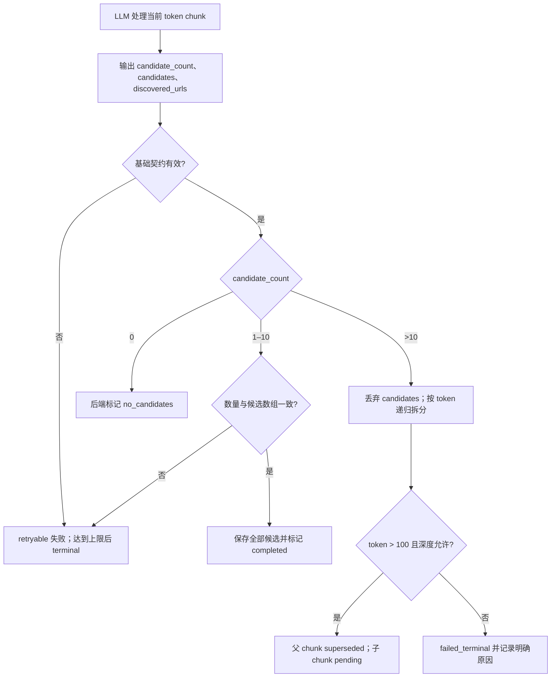

# Chunk Worker 候选计数与递归拆分设计

## 背景

Runtime V2 的 Chunk Worker 当前要求 LLM 同时输出候选详情和 `chunk_status`。其中 `chunk_status` 既表达内容判断，又直接控制后端状态机：

```text
completed / no_candidates / too_many_candidates
```

真实抓取华中科技大学教师列表页时，同一个含 3 位候选的 chunk 连续 3 次被 `deepseek-v4-flash` 返回为 `too_many_candidates`。将任务简化为单独计数时，模型能稳定返回 `3`；将任务简化为单独判断状态时，模型也能返回 `completed`。删除生产 Prompt 中的多个输出示例后，模型同样能够识别 3 位候选，但部分候选字段出现类型错误。

这说明问题不在页面缺少候选，也不在 150 token 拆分门槛本身。根因是完整 Prompt 同时要求模型完成候选计数、控制流选择和复杂结构输出，且 few-shot 示例中的短状态分支对最终输出产生了过强诱导。后端随后无条件信任模型返回的 `chunk_status`，把一次错误的状态选择放大成错误拆分或错误完成。

PR #73 通过站点特征和页面结构修正个别结果，但没有消除 LLM 直接控制后端状态机的问题。本设计不采用站点硬编码，也不按行数或链接数量决定拆分。

## 目标

- 让 LLM 只判断当前 chunk 中符合提交条件的候选总数，并输出候选数据。
- 由后端根据候选总数统一推导 chunk 状态和拆分控制流。
- 保持现有按估算 token 切分的实现，不改成按行或按链接数量切分。
- 允许 101–150 token 的候选密集 chunk 继续递归拆分。
- 降低候选递归拆分的 overlap，减少重复候选和无效 LLM 调用。
- 保持首次页面分块参数和其他抓取链路不变。

## 非目标

- 不引入学校、域名、URL 或页面模板的特例。
- 不用正则、链接数量或 DOM 行数替代 LLM 的候选数量判断。
- 不改变候选字段 schema、候选去重或补全流程。
- 不调整首次页面分块的 `overlap_tokens=180`。
- 不取消最小拆分门槛，也不为候选数量增加绕过门槛的特殊分支。
- 不在本次调整最大拆分深度、初始 chunk 目标大小或单次最多保存 10 位候选的限制。

## 方案选择

采用“LLM 输出数量，后端推导状态”的方案。

没有采用以下方案：

- 继续让 LLM 输出 `chunk_status`，只修改示例或措辞：模型仍同时承担语义判断和控制流决策，错误状态仍可直接驱动后端。
- 后端用 `len(candidates)` 决定是否拆分：当候选超过 10 位时，要求 LLM 输出所有候选会增加输出成本和截断风险；若只输出前 10 位，后端无法知道是否还有未输出候选。
- 后端按链接数或站点规则决定拆分：链接不一定代表导师，且会把站点结构假设引入通用抓取链路。

新方案保留 LLM 对页面语义和候选数量的判断能力，但把状态机所有权收回后端。`candidate_count` 是控制流的唯一模型输入，`chunk_status` 从 LLM 输出契约中删除。

## 新输出契约

Chunk Worker 必须只输出一个 JSON 对象：

```json
{
  "candidate_count": 1,
  "candidates": [
    {
      "name": "张三",
      "profile_url": "https://example.edu/zhang.html"
    }
  ],
  "discovered_urls": []
}
```

字段要求：

| 字段 | 要求 | 语义 |
| --- | --- | --- |
| `candidate_count` | 必填、JSON 非负整数 | 当前 chunk 中符合现有候选判定和提交条件的候选总数 |
| `candidates` | 必填数组 | 当数量为 1–10 时，包含当前 chunk 中的全部候选；其他情况为空数组 |
| `discovered_urls` | 必填数组 | 当前 chunk 中需要继续抓取的同域列表页、分页页或目录页 |

`candidate_count` 统计的是当前 chunk 中应提交的候选，不是链接数、文本行数或页面总人数推测。候选仍必须来自当前 chunk 的明确证据，并沿用现有最低提交条件。

三种合法输出形态为：

```json
{"candidate_count": 0, "candidates": [], "discovered_urls": []}
```

```json
{"candidate_count": 3, "candidates": [{"name": "张三", "profile_url": "https://example.edu/zhang.html"}, {"name": "李四", "profile_url": "https://example.edu/li.html"}, {"name": "王五", "profile_url": "https://example.edu/wang.html"}], "discovered_urls": []}
```

```json
{"candidate_count": 17, "candidates": [], "discovered_urls": []}
```

Prompt 必须明确约束：

- `candidate_count = 0` 时，`candidates` 必须为空。
- `candidate_count` 为 1–10 时，必须输出全部候选，且 `len(candidates) == candidate_count`。
- `candidate_count > 10` 时，`candidates` 必须为空；不能输出前 10 位，也不能输出完整候选数组。
- 不得输出 `chunk_status`、解释文字或 Markdown 代码块。
- 示例保持最少，只分别覆盖 0、1–10 和 >10 三种结构，不再让模型从多个状态字符串中选择控制流。

## 后端状态推导

后端完成 JSON 解析和 `candidate_count` 基础校验后，按固定规则处理：

| `candidate_count` | 后端动作 | 最终状态 |
| ---: | --- | --- |
| `0` | 不保存候选 | `no_candidates` |
| `1–10` | 校验并保存全部候选 | `completed` |
| `>10` | 不解析、不保存 `candidates`，递归拆分当前 chunk | 父 chunk 为 `superseded`，子 chunk 为 `pending` |

控制流不得再读取 LLM 返回的 `chunk_status`，也不得在缺少 `candidate_count` 时用 `len(candidates)` 猜测数量。现有数据库状态名继续保留，它们只是后端执行结果，不再是模型输入。

当 `candidate_count > 10` 时，Prompt 已要求 `candidates=[]`。后端仍以数量为权威并立即拆分；即使模型错误地同时返回候选，也丢弃候选、记录契约违规诊断，不让多余候选阻止已经明确需要执行的拆分。这样既不保存不完整结果，也不会因为候选字段类型错误而错过拆分。

`discovered_urls` 只在 chunk 完成处理时入队。进入拆分分支时沿用当前行为，不处理父 chunk 的 `discovered_urls`；子 chunk 会重新识别相关入口，避免父子重复入队。

## 一致性与错误处理

以下情况属于模型响应无效，进入现有 Chunk Worker 的 retryable 失败流程，并保留原始响应用于调试：

- 缺少 `candidate_count`、`candidates` 或 `discovered_urls`。
- `candidate_count` 不是 JSON 整数，或者为负数。
- `candidate_count = 0`，但 `candidates` 非空。
- `candidate_count` 为 1–10，但 `len(candidates) != candidate_count`。
- `candidate_count` 为 1–10，但任一候选无法通过现有 `ProfessorCandidatePayload` 校验。
- `candidates` 或 `discovered_urls` 不是数组。

无效响应不得被静默改写为 `no_candidates`、`completed` 或拆分，不得保存部分候选。达到现有重试上限后，沿用 `failed_terminal` 语义，并把具体契约错误写入 `last_error` 和调试日志。

`candidate_count > 10` 是唯一例外：后端不校验候选数组中的候选 schema，而是直接丢弃该数组并拆分。若 `candidates` 非空，日志记录 `candidate_count_candidates_conflict`，但不把当前 chunk 标为失败。

## Token 拆分参数

保持统一的 token 估算和现有候选密集切分算法，只调整两个递归拆分参数：

```python
ChunkingConfig(
    overlap_tokens=180,                 # 首次页面分块保持不变
    min_split_tokens=100,               # 原值 150
    retry_split_overlap_tokens=15,      # 原值 30
)
```

具体边界：

- `token_estimate > 100` 的 chunk 可以继续递归拆分。
- `token_estimate <= 100` 的 chunk 不再拆分。
- `retry_split_overlap_tokens=15` 只作用于 `too_many_candidates` / `candidate_count_exceeded` 触发的候选密集递归拆分。
- 首次页面分块继续使用 `overlap_tokens=180`，不受本次调整影响。
- `max_split_depth=7` 保持不变。

不增加“`candidate_count > 10` 时绕过最小 token 下限”的特殊逻辑。若模型声称一个不超过 100 token 的 chunk 含有 10 位以上候选，系统不能通过无限拆分掩盖计数异常，应明确终止该 chunk。

当 `candidate_count > 10`，但 chunk 因 `token_estimate <= 100`、达到最大深度或切分算法没有生成有效子 chunk 而无法拆分时：

- 标记为 `failed_terminal`；
- 不保存父 chunk 中的部分候选；
- `last_error` 区分“低于拆分门槛”“超过最大拆分深度”和“未生成有效子 chunk”；
- 调试日志记录 `candidate_count`、`token_estimate`、`split_depth` 和失败原因。

## 数据流



## 真实页面参数验证

使用本机已有的华中科技大学真实抓取快照重放当前 token 切分算法。页面共包含 150 个唯一教师链接。

候选递归 overlap 从 30 降到 15，目的是降低递归边界的重复内容，同时为跨 chunk 的姓名和链接保留上下文余量。实际页面的节点数和原始链接重复数受首次页面分块 overlap、页面内容分布和 URL 规范化口径影响，因此只读回放应记录这些数据，而不将预设数值作为功能验收条件。

将 `min_split_tokens` 从 150 分别扫描到 100、75、50、25 和 1，在该华科页面上的调用节点、重复候选和唯一候选均无变化。原因是实际超过 10 位候选的 chunk 都高于 180 token。把门槛设为 100 不会改变该页面当前结果，但能覆盖其他页面中 101–150 token 的候选密集 chunk，同时继续保留明确的递归终止条件。

历史错误 chunk 实际只有 3–8 位候选。新控制流会根据 `candidate_count` 将它们直接保存为 `completed`，不会再因为错误的 `too_many_candidates` 状态进入拆分。

## 测试策略

### Prompt 与解析测试

- Prompt 只声明 `candidate_count`、`candidates` 和 `discovered_urls`，不再出现可输出的 `chunk_status`。
- Prompt 明确要求 `candidate_count > 10` 时 `candidates=[]`。
- 合法解析 0、1、10 和 11 四个边界数量。
- 拒绝缺字段、负数、小数、布尔值、数字字符串和非数组字段。
- 1–10 时拒绝数量与数组长度不一致的结果。
- >10 时不解析候选 schema，并在候选数组非空时记录诊断后继续拆分。

### 后端控制流测试

- 0 位候选标记为 `no_candidates`，不保存候选。
- 1–10 位候选保存后标记为 `completed`。
- 11 位及以上候选触发拆分，父 chunk 不保存候选。
- 后端完全忽略模型附带的旧 `chunk_status` 字段，不能由其改变控制流。
- count 与候选数组不一致时不保存部分候选，并进入现有重试流程。
- 拆分分支不处理父 chunk 的 `discovered_urls`。

### Chunking 测试

- 默认 `min_split_tokens` 为 100，101 token 可以拆分，100 token 不能拆分。
- 候选密集递归拆分 overlap 上限为 15 token。
- 首次页面分块 overlap 仍为 180 token。
- 低于门槛、达到最大深度和无有效子 chunk 分别产生可诊断的 terminal 错误。
- 现有 token 估算、动态分片数量、chunk ID 和父子关系不回归。

### 真实数据回归

- 对同一华科快照执行只读重放，记录发现的教师链接数、节点数、重复链接数和 URL 规范化口径。
- 历史 3–8 人失败 chunk 均进入 `completed` 路径，不再返回或映射成 `no_candidates` / `too_many_candidates`。
- 测试只读取固定快照，不依赖实时网络和 LLM 服务。

## 可观测性

Chunk Worker 的 `llm_response` 和 `chunk_completed` 调试事件增加或保留以下字段：

- 原始 `candidate_count`；
- 后端推导出的 `derived_chunk_status`；
- 实际 `len(candidates)`；
- 是否触发拆分；
- `token_estimate`、`split_depth` 和拆分失败原因；
- count 与候选数组冲突时的稳定错误代码。

日志保留原始模型文本和解析后 payload 的现有调试能力，但控制流只能使用已校验的 `candidate_count`。

## 验收标准

- LLM 输出契约中不再包含 `chunk_status`，后端也不再接受它作为控制流输入。
- `candidate_count` 分别为 0、1–10 和 >10 时，后端稳定推导为无候选、完成和拆分。
- Prompt 明确限制 `candidate_count > 10` 时 `candidates=[]`。
- 拆分仍按 token 进行，不依赖行数、链接数或站点特例。
- 101–150 token 的候选密集 chunk 可以继续拆分，100 token 及以下明确终止。
- 候选递归 overlap 为 15，首次页面分块 overlap 仍为 180。
- 华科固定快照回归只读记录候选链接、调用节点和重复链接统计，不将未经用户确认的阈值作为验收条件。
- 任一解析或一致性错误都不会被静默转成 `no_candidates`，也不会保存不完整候选。
- 无法继续拆分时产生明确 terminal 失败和可定位日志，不使用绕过最小门槛的特殊逻辑。
