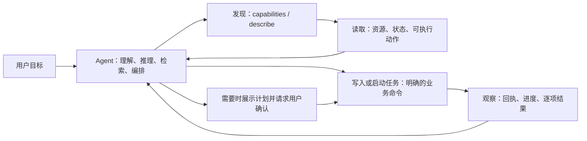

# Agent-first 通用 CLI 演进路线

- 文档状态：已完成的接口演进设计；保留设计原因，不再作为执行合同。
- 日期：2026-08-09
- 适用项目：Auto Email Sender
- 关联基线：[Agent 通用 CLI 产品与技术设计](../product/agent_cli_design.md)
- 当前协议和能力以 `auto-email-sender --format json capabilities` 为准。
- 本次验收报告：[agent_cli_goal_acceptance.md](agent_cli_goal_acceptance.md)

## 1. 本文档解决什么问题

Auto Email Sender 已经具备一套广泛的 Agent CLI 能力。下一阶段的重点不是继续为某个具体用户需求增加一个专用命令，而是把这套 CLI 打磨成任何本地 Agent 都能稳定使用的通用业务接口。

用户可能说：

- “阅读全部回信，找出表达暂时没有名额的导师，再准备二次联系草稿。”
- “从一次抓取记录中找出资料不完整的人，去公开网站核实后补上信息，留给我审核。”
- “筛选符合条件的导师，按指定模板、附件和 AI 设置创建草稿。”
- “暂停一个正在运行的任务，分析失败原因后只重试失败项。”

这些都只是用户意图的例子，**不是应当写死进产品的功能名**。正确的产品形态是：Agent 自己理解意图、分析数据、选择检索手段并组合命令；CLI 提供完整、可靠、可发现、可验证的业务积木。

本文定义这套积木应如何演进，以及完成后如何验收。

## 2. 已确认且不在本轮重新讨论的边界

以下决定已经确认，后续实现必须遵守：

1. CLI 是通用产品能力，不绑定 Codex，也不绑定某个固定邮件场景。
2. 任意能执行本机命令的 Agent 都可以使用它；CLI 不依赖 MCP、Plugin 或云端 Agent。
3. Agent 负责自然语言理解、语义判断、外部检索和任务编排；软件负责业务事实、规则校验、状态管理、执行和审计。
4. CLI 不能直接读写 SQLite，不能提供原始 HTTP、SQL、任意脚本或绕过状态机的入口。
5. 软件未运行时，CLI 只能提示用户手动打开软件，不能自行启动、唤醒或隐藏运行桌面应用。
6. 密码、API Key、访问令牌和其他秘密不能出现在 CLI 参数、输出、错误或日志中；必要的凭据录入仍在 GUI 完成。
7. 草稿生成和真实发送必须分离；真实发送必须经过一次性计划和用户明确确认。
8. Skill 是轻量的全局使用规范，不是重复维护全部命令、业务流程或产品能力的第二份说明书。
9. Windows x64 和 macOS Apple Silicon 是当前支持平台；Intel Mac、MCP、专用 Agent Plugin 仍不在本阶段范围内。

## 3. 北极星目标：让陌生 Agent 不需要“摸索”

一个刚接入、没有预先了解 Auto Email Sender 的 Agent，应当只通过 CLI 的实时返回就能安全完成下面的循环：



这里的关键不是让 CLI 替 Agent “思考”，而是保证 Agent 每一步都能得到可靠答案：

- 现在有哪些能力，哪些不可用，为什么？
- 一个命令接受什么输入、返回什么结果、会改变什么？
- 当前对象处于什么状态，下一步哪些操作合法？
- 数据很多时，怎样只取需要的部分，而不是把上下文塞满？
- 网络中断、应用更新或用户同时在 GUI 修改时，怎样安全恢复？
- 一次操作实际改变了什么，是否已经完成，是否还需要人工确认？

## 4. Agent 与 CLI 的正确分工

| 工作 | 应由谁负责 | 原因 |
|---|---|---|
| 理解“没名额”“适合我”“优先联系”等自然语言含义 | Agent | 这是语义判断，会随用户目标和上下文变化。 |
| 搜索公开网页、判断来源是否可靠、选择研究策略 | Agent | 不同 Agent 的浏览和检索能力不同，不应假装 CLI 自带全网研究能力。 |
| 读取软件中的导师、邮件、模板、材料、任务和日志 | CLI | 软件拥有最新、完整、结构化的业务数据。 |
| 创建、修改、暂停、恢复、导入、生成草稿、发送 | CLI | 这些动作需要业务校验、状态机、审计和防重复保护。 |
| 判断一个动作在当前状态是否允许 | CLI | 规则不能靠 Agent 记忆或猜测。 |
| 风险提示、影响预览、用户确认和防重复执行 | CLI | 这些是产品安全承诺，不能只写在提示词里。 |

因此，不新增 `search-email`、`find-no-capacity`、`do-user-request` 这类专用或万能命令。要新增的是每一种资源都可组合的读取、筛选、修改、批量处理、观察和恢复能力。

## 5. 当前基线与需要解决的通用缺口

当前 CLI 已有很好的基础：JSON/JSONL 输出、稳定对象 ID、`capabilities`、`describe`、`guide`、风险分级、发送计划、Agent API、秘密脱敏和桌面端启用管理。

本轮要解决的不是“有没有命令”，而是下面这些 Agent 使用体验问题。

| 领域 | 当前摩擦 | 通用改进方向 |
|---|---|---|
| 自我发现 | `describe` 主要描述输入参数；Agent 很难预先知道输出结构、状态含义和恢复方式。部分建议下一步的逻辑只是按命令名称匹配，可能不相关。 | 让每个命令拥有完整机器可读合同，并由业务状态给出准确的后续动作。 |
| 数据读取 | 各资源的列表能力、筛选能力、字段数量和导出方式不完全统一。`--all` 在大数据量时会把大量结果汇总到 stdout。 | 建立统一的列表、筛选、分页、字段选择、摘要和文件导出约定。 |
| 对象状态 | Agent 能读到 `running`、`paused`、`needs_review` 等状态，但通常还需自己推断哪些动作合法。 | 每个可状态化对象都返回 `available_actions`、阻塞原因和状态转换说明。 |
| 写入可靠性 | Agent 需要区分“没有传这个字段”“清空这个字段”“把它设为某值”；中断后的跨进程重试也需要复用同一操作标识。 | 统一 PATCH 语义、显式清空、可复用请求 ID、对象版本检查和变更回执。 |
| 长任务 | 抓取、补全、匹配、生成等任务的进度和逐项结果形态不完全一致。 | 建立统一的任务状态、逐项结果、等待、取消、恢复和部分成功模型。 |
| 批量操作 | 某些领域已有计划式批量动作，某些领域只能循环逐项调用。 | 统一 JSON 文件/标准输入批量输入、影响预览、确认计划和逐项回执。 |
| 追溯 | Agent 修改后的“谁改了什么、为什么、引用什么来源”并非所有资源都有同一种可读回执。 | 统一操作回执、审计关联、来源/证据引用和 GUI 可见的变更历史。 |
| 演进一致性 | 能力清单、命令描述、guide、Skill、后端 DTO、前端功能和测试有多个维护位置。 | 建立单一能力注册表与覆盖测试，避免文档、Skill 和实际功能漂移。 |

## 6. 目标接口：Agent 可组合的六类原语

CLI 的每项能力都应归入以下一类或多类原语。它们是通用接口，不以“导师”“邮箱”或其他单一业务场景命名。

### 6.1 发现（Discover）

Agent 在不依赖已安装 Skill、旧文档或猜测命令名称的前提下，发现当前版本实际能做什么。

保留并升级：

```text
auto-email-sender --format json capabilities
auto-email-sender --format json capabilities --resource campaigns
auto-email-sender --format json describe --command campaigns.prepare-send
```

`capabilities` 的每项能力至少应包含：

- 稳定能力 ID 与用户可执行的命令路径。
- 当前可用性：`available`、`ui_only`、`planned` 或 `unsupported_on_platform`。
- 风险、外部服务、是否可能消耗 Token、是否改变数据、是否需要计划/确认。
- 输入和输出合同版本。
- 资源类型、是否支持批量、是否支持等待、是否支持幂等重试。
- 只有 GUI 可完成时的具体原因和推荐页面，而不是笼统地说“不支持”。

### 6.2 读取与定位（Read and Resolve）

所有可列表资源逐步遵循同一套能力，而不是分别设计一套 flag：

| 能力 | 目标行为 |
|---|---|
| 分页 | 统一 `--cursor`、`--limit`，响应中有稳定 `next_cursor` 与 `has_more`。 |
| 字段选择 | `--fields` 或等价 JSON 输入只返回需要的字段，默认列表保持小而可读。 |
| 关联展开 | `--include` 明确请求关联资源，避免 Agent N+1 次调用。 |
| 排序 | 只允许注册过的字段和方向，不能暴露任意数据库排序表达式。 |
| 结构化筛选 | 只支持已声明字段和运算符；复杂条件使用 JSON 文件或 stdin，不设计 SQL-like 任意字符串。 |
| 摘要 | 支持总数、状态分布、时间范围等低成本统计，帮助 Agent 先决定是否需要取详情。 |
| 名称解析 | 对用户给出的自然语言名称提供受控搜索/解析；唯一时返回 ID，多项命中时返回候选而不是擅自选择。 |
| 大数据导出 | 每个大列表都可输出 JSONL 到指定文件；stdout 只返回导出清单、数量和路径。 |

这并不等于让软件替 Agent 做语义筛选。例如“回复的意思是没有名额”仍由 Agent 读取邮件后判断；但“字段为空”“状态为待审核”“创建时间在某范围内”是确定性结构条件，应能由通用筛选能力完成。

### 6.3 理解命令（Describe）

`describe` 升级为命令合同，而不只是帮助页面的 JSON 化。每个命令应返回：

```json
{
  "command": "<稳定能力 ID>",
  "input": {
    "schema": "<JSON Schema 或等价结构>",
    "clear_semantics": "omitted / set / clear 的规则",
    "file_and_stdin_examples": []
  },
  "output": {
    "schema": "<稳定输出 schema>",
    "pagination": true,
    "terminal_states": ["succeeded", "failed", "canceled"]
  },
  "effects": {
    "mutates": true,
    "external_services": ["llm"],
    "cost_may_apply": true,
    "reversible": true,
    "requires_explicit_user_intent": true,
    "requires_confirmation_plan": false
  },
  "preconditions": [],
  "state_transitions": [],
  "errors": [],
  "next_actions": []
}
```

其中 `next_actions` 必须由实际资源状态和业务规则产生，不能根据命令字符串做模糊匹配。例如一个已暂停活动应收到“可准备恢复”的动作；一个没有待发送项目的活动不应收到“发送”的建议。

### 6.4 行动（Act）

写操作需要统一解决四件事。

#### 明确的部分更新

- 没有传字段：保留原值。
- 传入值：设为该值。
- 明确清空：使用统一的 `clear` 表达，而不是让空字符串或缺失字段产生歧义。
- 复杂输入优先支持 `--input <json-file>` 和 stdin；flags 作为常用字段的便捷入口。

#### 安全重试

每个写操作支持可由 Agent 保存和重用的 `--request-id`（或等价 `--idempotency-key`）。CLI 可以自动生成默认值，但必须把该值写回响应；Agent 在超时、不确定是否成功、或进程重启后重试同一用户意图时能复用它。

#### 并发保护

读操作返回对象 `revision`（或等价版本/更新时间指纹）。写操作可携带 `--if-revision`：如果用户在 GUI、另一 CLI 调用方或后台任务中已经修改对象，CLI 返回结构化冲突和最新摘要，而不是静默覆盖。

#### 变更回执

每次成功写入返回统一 `mutation_receipt`：

```json
{
  "request_id": "req_...",
  "status": "applied",
  "changed_resources": [
    {
      "type": "<resource>",
      "id": "<stable-id>",
      "before": {"...": "..."},
      "after": {"...": "..."},
      "changed_fields": ["..."]
    }
  ],
  "warnings": [],
  "audit_reference": "..."
}
```

对于大对象或敏感内容，`before`/`after` 可采用脱敏摘要、哈希或字段级摘要；不能借回执泄露秘密。

### 6.5 观察与恢复（Observe and Recover）

所有异步或长时间操作，无论是抓取、补全、匹配、AI 草稿还是批量发送，都应使用一致的任务协议：

- 稳定 `job_id`、`kind`、`status`、创建/开始/结束时间。
- 明确的非终态和终态：`queued`、`running`、`paused`、`succeeded`、`partially_succeeded`、`failed`、`canceled`。
- 每个工作项拥有自己的状态、错误、重试次数、输出摘要和关联对象 ID。
- `available_actions` 表示当前可暂停、取消、恢复、重试或归档哪些动作。
- 提供统一 `wait`/`watch` 行为，支持超时和轮询间隔；它只等待已经运行的桌面应用，不会启动应用。
- 任何“已提交”响应都清楚说明是“已经入队”还是“已经完成”，不能让 Agent 把排队误报为成功。

### 6.6 计划与确认（Plan and Confirm）

对需要影响预览或用户确认的风险动作保留并统一计划模型。风险等级不是唯一判断：会删除、批量修改、合并或造成外部不可逆影响的 L2 动作必须预览；会调用 LLM 或网页、但只在用户已明确要求下启动的 L2 动作至少必须返回机器可读的范围、外部服务和费用提示；所有 L3 动作必须使用确认计划：

1. `prepare-*` 或通用批量准备命令生成不可执行副作用的影响预览。
2. 响应明确受影响资源、增删改内容、外部服务、费用提示、风险和到期时间。
3. Agent 向用户展示摘要；只有用户明确确认后才执行。
4. `plans execute <plan-id> --confirm` 可安全重试且不会重复产生副作用。
5. 若对象版本、内容或范围已变化，计划返回 `PLAN_STALE`，必须重新预览。

计划不是只用于邮件发送。批量删除、批量导入、不可逆合并、跨对象关系变更等同样应使用它。单项、可逆、低影响编辑可直接写入并返回回执。

## 7. 单一事实来源：避免能力、说明和实现漂移

CLI 的长远可靠性取决于一份统一的“能力注册信息”。目前命令、能力清单、说明、风险信息、测试和 UI 功能映射有多个维护点。下一阶段应逐步收敛为下面的结构：

```text
业务动作/资源定义
        │
        ├── Agent API 输入输出 DTO
        ├── CLI 命令与 JSON 合同
        ├── capabilities
        ├── describe
        ├── guide 的简短规则片段
        ├── 风险与确认策略
        └── 契约测试与 GUI 覆盖测试
```

目标不是立刻重写所有命令，而是让每个新改动都不再需要手工同步五六份清单。

建议的最小实现：

1. 定义 `CommandContract` / `ResourceContract` 数据模型。
2. 每项能力声明输入 schema、输出 schema、风险、外部影响、状态前置条件、可用性和错误码。
3. `capabilities` 与 `describe` 从该模型生成；命令可引用它，但不再各自维护不同事实。
4. Skill 只描述通用安全原则与发现顺序；不复制命令表。
5. CI 校验“实际注册命令”“能力合同”“Agent API 路由”“测试用例”之间没有遗漏。

## 8. GUI 与 CLI 的覆盖契约

“CLI 具备 GUI 能力”不应靠口头判断。每个面向用户的业务动作都必须有一条覆盖记录：

| GUI 业务动作 | CLI 状态 | 原因 / 入口 | 自动化检查 |
|---|---|---|---|
| 读取、筛选、导出业务数据 | `available` | 资源读取合同 | 命令与 schema 测试 |
| 非敏感编辑、草稿、任务控制 | `available` | 受控写入合同 | 正常、冲突、重试测试 |
| 批量/删除/导入/发送 | `available`，但需要计划 | 影响预览与确认 | 计划、stale、幂等测试 |
| 密码、API Key、敏感账号配置 | `ui_only` | 防止出现在 Agent 对话和命令历史 | 确认无 CLI 写入口 |
| 平台或产品尚未实现的功能 | `planned` / `unsupported_on_platform` | 明确原因与替代路径 | 覆盖表校验 |

新增 GUI 功能的 Definition of Done 增加一项：开发者必须在 PR/实现中选择 `available`、`ui_only` 或 `planned`，并提供理由。未经选择的用户可见业务动作不能视为完成。

## 13. 不做的事情

为了保持接口通用、可靠和安全，本路线明确不做：

- 把自然语言任务直接塞进一个 `run "..."` 命令。
- 为每个用户例子新增专用“智能功能”命令。
- 让 CLI 假装拥有所有 Agent 的网页搜索、浏览器、文件阅读或模型能力。
- 提供 SQL、任意 HTTP 请求、任意脚本或数据库写入绕过接口。
- 因为 Agent 想要执行操作而自动启动桌面应用。
- 将秘密放入 flag、stdin、日志、Skill 或普通 JSON 输出。
- 用长篇静态 Skill 代替实时、机器可读的 CLI 合同。

## 14. 实施默认决策

除非后续发现与现有业务规则冲突，实施时可直接采用以下默认值：

1. 保持正式命令名 `auto-email-sender`、本地 Agent API 和现有确认计划模型。
2. 优先以向后兼容的 JSON 扩展字段推进；不删除现有成功响应字段。
3. 复杂批量请求使用 JSON 文件或 stdin，不用逗号拼接和超长 shell 参数承载数据。
4. 资源筛选是白名单结构化能力，不是 SQL 或任意表达式语言。
5. `request_id` 是 Agent 可保存、可重用的稳定操作标识；默认生成仅是便利，不是唯一机制。
6. 任何外部服务调用、潜在费用和用户确认条件都以机器可读字段返回。
7. 无法安全开放给 Agent 的功能诚实标为 `ui_only`，并解释原因；不为了“全覆盖”而降低秘密或发送安全性。

## 16. Agent 检索与执行连续性改进（2026-08-10）

### 16.1 从本次真实任务暴露的问题

“找出姓名含英文字母的导师并批量移入回收站”同时经过能力发现、数据筛选、批量选择、计划确认和结果核验。原实现分别存在以下摩擦：

- `capabilities --query` 只是词法近似搜索，但输出没有置信度或命中原因；通用词会把无关命令混进前列。
- `--query` 同时用于“搜索 CLI 能力”和“搜索导师数据”，Agent 很难仅从参数名判断层级。
- 没有安全的 Unicode 字符类别筛选，只能先读取全部导师再自行匹配；超过 500 项时 stdout 又只保留数组摘要。
- 批量计划只接受显式 ID，导致 Agent 必须把数千个 ID 从读取结果复制到下一次调用。
- 计划确认只绑定 `plan_id`，没有绑定用户实际看到的计划内容版本；执行结果也会默认把小型 `result` 对象摘要掉。

这里的 `capabilities --query`（现推荐写作 `--intent`）只在本地能力目录中做确定性意图路由，不查询导师、邮件或其他业务数据。`professors list --query`（现也可写作 `--search`）才会查询导师数据。两个旧参数均保留兼容。

### 16.2 参考的 Agent 友好 CLI 设计

- [OpenAI：Create a CLI Codex can use](https://developers.openai.com/codex/use-cases/agent-friendly-clis)：默认输出小而稳定，优先显式字段，完整大结果写文件。
- [GitHub CLI JSON formatting](https://cli.github.com/manual/gh_help_formatting)：通过 `--json`/字段选择控制机器输出，而不是让调用方解析人类表格。
- [Kubernetes field selectors](https://kubernetes.io/docs/concepts/overview/working-with-objects/field-selectors/)：筛选字段和运算符由资源合同声明并由服务端验证。
- [Terraform saved plans](https://developer.hashicorp.com/terraform/cli/commands/apply)：先查看不可变计划，再执行同一份计划，而不是确认后重新解析动态范围。
- [Claude Code headless mode](https://code.claude.com/docs/en/headless) 与 [Gemini CLI headless mode](https://geminicli.com/docs/cli/headless/)：机器模式保持单一结构化输出、稳定退出码，并把进度噪声与结果分离。

本项目不照搬任何一个工具的命令形态，而是采用其中可通用验证的合同：小默认输出、可解释路由、白名单选择器、文件恢复动作、不可变计划和版本绑定确认。

### 16.3 实施计划与验收合同

| 阶段 | 改进 | 验收方式 |
|---|---|---|
| 意图发现 | 增加 `--intent`/`--search` 清晰别名；搜索卡返回模式、分数、置信度、理由与命中词；按最强匹配相对阈值去除长尾噪声。 | 三条真实中文任务意图均稳定 Top 1；姓名筛选任务不再返回无关命令。 |
| 结构筛选 | 增加固定白名单 `contains_script`，首批支持 `latin`、`han`、`cyrillic`、`arabic`、`digit`；仅在合同声明的文本字段使用。 | `José` 与中英混合姓名命中 latin；纯汉字不命中；非法字段/脚本在联网前失败。 |
| 服务端下推 | 将导师姓名脚本条件下推为 `name_script`，CLI 仍做完整本地复核并报告执行模式。 | 新后端减少扫描；模拟忽略参数的旧后端仍得到相同结果。 |
| 批量连续性 | 批量归档接受 `SelectionSpec`、筛选范围与排除项；生成计划时冻结精确 ID 和哈希。 | 计划生成后新增的匹配导师不会被执行；排除项保持不变。 |
| 大结果恢复 | 顶层集合被摘要或预算压缩时返回机器可执行 `recovery_action`。 | 501 项集合返回 `export_complete_collection` 与所需 `output_file`，不要求 Agent 猜重试方式。 |
| 确认与回执 | 变更计划计算 `content_fingerprint`；执行可提交 `confirmed_fingerprint`；小型执行结果直接显示，批量归档返回最终状态。 | 错误指纹返回 `PLAN_CONFIRMATION_MISMATCH` 且零副作用；正确指纹执行一次；旧调用保持兼容。 |
| 分发与防回归 | 同步 Skill、命令合同、意图基准和单元/集成测试。 | CLI 全量、相关后端测试与仓库质量门禁全部通过。 |

这些改进仍遵守第 2 节的安全边界：不开放任意正则、SQL 或 HTTP；不自动启动桌面软件；批量归档仍只生成计划，必须经过用户明确确认后才执行。

## 17. CLI → 桌面 UI handoff（2026-08-10）

### 17.1 新增的通用原语

“筛选”可能有两种不同交付物：一种是把数据返回给 Agent 继续推理，另一种是把结果直接交给用户在软件里检查。后者不能用聊天窗口中的名单代替，也不能为了产生可见效果而偷偷执行归档、编辑或发送。

本轮增加 `present` 原语：CLI 创建短期、类型化、可观察的 UI handoff，Desktop 聚焦窗口并导航，目标页面只应用临时选择或定位状态。第一批覆盖导师管理、首页看板、发送计划、抓取任务、通信线程和草稿工作区；完整协议见 [Agent UI handoff 架构](../architecture/agent-ui-handoffs.md)。

导师筛选的标准调用形态为：

```text
auto-email-sender --format json professors present-selection \
  --selection-filter '{"name":{"contains_script":"latin"}}' \
  --display selected-only
```

CLI 由后端冻结精确 ID 并返回 `handoff_id`。需要确认页面是否实际应用时，调用返回的 `ui-handoffs.wait` action；`awaiting_user` 表示草稿保护或页面交互阻止了自动导航，应把决定权留给用户。

### 17.2 设计与安全合同

- `present` 的 `effects.mutates` 为 false，但会聚焦窗口、导航并应用临时 UI 状态，因此要求用户意图明确。
- 创建响应不输出冻结 ID；Desktop 以 30 秒租约一次领取，Renderer 使用 sessionStorage 去重并持久化 ACK，支持刷新和暂时断连恢复。
- `professors.present-selection` 同时接受显式 ID、结构化筛选或受控 `--all`，并支持 replace/add 与 selected-only/keep-current。
- 首页 handoff 必须绑定发件身份且不接受已归档导师；管理页可自动切换 active、archived 或混合范围。
- 通信线程以 presentation-only 打开，不能因为“展示历史”而创建新的邮件任务；草稿则必须按冻结的 `task_id` 精确加载。
- 未保存草稿统一经过工作区 guard；用户拒绝导航时 ACK 为 `awaiting_user`，不会丢失编辑内容或形成重复确认。
- 需要归档、编辑、生成或发送时仍使用对应业务命令和计划，不能把副作用塞入页面适配器。

### 17.3 可发现性与回归门禁

`capabilities --intent "只筛选出名字有英文的导师，在软件页面里勾选，不要后续操作"` 必须把 `professors.present-selection` 稳定排在首位；已有资源详情会返回 `present-in-app` action。CLI、后端、Desktop 和 Frontend 分层测试覆盖幂等创建、选择冻结、surface/身份校验、并发领取、租约恢复、重复投递、过期缓存、ACK 重试、草稿保护、混合归档分页以及各页面适配器。

未来新增可在 GUI 中直接定位的资源时，应优先扩展同一 handoff 协议和类型化 surface，而不是新增一次性的跳转参数或 sessionStorage key。任何新 surface 都必须声明固定 route、冻结资源、页面效果、身份约束、ACK 结果和失败恢复方式。
