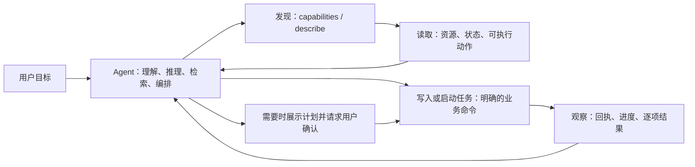

# Agent-first 通用 CLI 演进路线

- 文档状态：Goal 执行合同（G1–G10 已按第 10.5 节验收通过）
- 日期：2026-08-09
- 适用项目：Auto Email Sender
- 关联基线：[Agent 通用 CLI 产品与技术设计](../product/agent_cli_design.md)
- 当前快照：CLI 协议 v3；当前注册表显示 158 项能力，其中 156 项可用、2 项因凭据安全限制仅桌面端可用。22 个分页集合已统一支持字段选择、结构化筛选与文件导出；该数字会随版本变化，实际能力始终以 `auto-email-sender --format json capabilities` 为准。
- 本次验收报告：[agent_cli_goal_acceptance.md](agent_cli_goal_acceptance.md)

## 1. 本文档解决什么问题

Auto Email Sender 已经具备一套广泛的 Agent CLI 能力。下一阶段的重点不是继续为某个具体用户需求增加一个专用命令，而是把这套 CLI 打磨成任何本地 Agent 都能稳定使用的通用业务接口。

用户可能说：

- “阅读全部回信，找出表达暂时没有名额的导师，再准备二次联系草稿。”
- “从一次抓取记录中找出资料不完整的人，去公开网站核实后补上信息，留给我审核。”
- “筛选符合条件的导师，按指定模板、附件和 AI 设置创建草稿。”
- “暂停一个正在运行的任务，分析失败原因后只重试失败项。”

这些都只是用户意图的例子，**不是应当写死进产品的功能名**。正确的产品形态是：Agent 自己理解意图、分析数据、选择检索手段并组合命令；CLI 提供完整、可靠、可发现、可验证的业务积木。

本文定义这套积木应如何演进，以及完成后如何验收。

## 2. 已确认且不在本轮重新讨论的边界

以下决定已经确认，后续实现必须遵守：

1. CLI 是通用产品能力，不绑定 Codex，也不绑定某个固定邮件场景。
2. 任意能执行本机命令的 Agent 都可以使用它；CLI 不依赖 MCP、Plugin 或云端 Agent。
3. Agent 负责自然语言理解、语义判断、外部检索和任务编排；软件负责业务事实、规则校验、状态管理、执行和审计。
4. CLI 不能直接读写 SQLite，不能提供原始 HTTP、SQL、任意脚本或绕过状态机的入口。
5. 软件未运行时，CLI 只能提示用户手动打开软件，不能自行启动、唤醒或隐藏运行桌面应用。
6. 密码、API Key、访问令牌和其他秘密不能出现在 CLI 参数、输出、错误或日志中；必要的凭据录入仍在 GUI 完成。
7. 草稿生成和真实发送必须分离；真实发送必须经过一次性计划和用户明确确认。
8. Skill 是轻量的全局使用规范，不是重复维护全部命令、业务流程或产品能力的第二份说明书。
9. Windows x64 和 macOS Apple Silicon 是当前支持平台；Intel Mac、MCP、专用 Agent Plugin 仍不在本阶段范围内。

## 3. 北极星目标：让陌生 Agent 不需要“摸索”

一个刚接入、没有预先了解 Auto Email Sender 的 Agent，应当只通过 CLI 的实时返回就能安全完成下面的循环：



这里的关键不是让 CLI 替 Agent “思考”，而是保证 Agent 每一步都能得到可靠答案：

- 现在有哪些能力，哪些不可用，为什么？
- 一个命令接受什么输入、返回什么结果、会改变什么？
- 当前对象处于什么状态，下一步哪些操作合法？
- 数据很多时，怎样只取需要的部分，而不是把上下文塞满？
- 网络中断、应用更新或用户同时在 GUI 修改时，怎样安全恢复？
- 一次操作实际改变了什么，是否已经完成，是否还需要人工确认？

## 4. Agent 与 CLI 的正确分工

| 工作 | 应由谁负责 | 原因 |
|---|---|---|
| 理解“没名额”“适合我”“优先联系”等自然语言含义 | Agent | 这是语义判断，会随用户目标和上下文变化。 |
| 搜索公开网页、判断来源是否可靠、选择研究策略 | Agent | 不同 Agent 的浏览和检索能力不同，不应假装 CLI 自带全网研究能力。 |
| 读取软件中的导师、邮件、模板、材料、任务和日志 | CLI | 软件拥有最新、完整、结构化的业务数据。 |
| 创建、修改、暂停、恢复、导入、生成草稿、发送 | CLI | 这些动作需要业务校验、状态机、审计和防重复保护。 |
| 判断一个动作在当前状态是否允许 | CLI | 规则不能靠 Agent 记忆或猜测。 |
| 风险提示、影响预览、用户确认和防重复执行 | CLI | 这些是产品安全承诺，不能只写在提示词里。 |

因此，不新增 `search-email`、`find-no-capacity`、`do-user-request` 这类专用或万能命令。要新增的是每一种资源都可组合的读取、筛选、修改、批量处理、观察和恢复能力。

## 5. 当前基线与需要解决的通用缺口

当前 CLI 已有很好的基础：JSON/JSONL 输出、稳定对象 ID、`capabilities`、`describe`、`guide`、风险分级、发送计划、Agent API、秘密脱敏和桌面端启用管理。

本轮要解决的不是“有没有命令”，而是下面这些 Agent 使用体验问题。

| 领域 | 当前摩擦 | 通用改进方向 |
|---|---|---|
| 自我发现 | `describe` 主要描述输入参数；Agent 很难预先知道输出结构、状态含义和恢复方式。部分建议下一步的逻辑只是按命令名称匹配，可能不相关。 | 让每个命令拥有完整机器可读合同，并由业务状态给出准确的后续动作。 |
| 数据读取 | 各资源的列表能力、筛选能力、字段数量和导出方式不完全统一。`--all` 在大数据量时会把大量结果汇总到 stdout。 | 建立统一的列表、筛选、分页、字段选择、摘要和文件导出约定。 |
| 对象状态 | Agent 能读到 `running`、`paused`、`needs_review` 等状态，但通常还需自己推断哪些动作合法。 | 每个可状态化对象都返回 `available_actions`、阻塞原因和状态转换说明。 |
| 写入可靠性 | Agent 需要区分“没有传这个字段”“清空这个字段”“把它设为某值”；中断后的跨进程重试也需要复用同一操作标识。 | 统一 PATCH 语义、显式清空、可复用请求 ID、对象版本检查和变更回执。 |
| 长任务 | 抓取、补全、匹配、生成等任务的进度和逐项结果形态不完全一致。 | 建立统一的任务状态、逐项结果、等待、取消、恢复和部分成功模型。 |
| 批量操作 | 某些领域已有计划式批量动作，某些领域只能循环逐项调用。 | 统一 JSON 文件/标准输入批量输入、影响预览、确认计划和逐项回执。 |
| 追溯 | Agent 修改后的“谁改了什么、为什么、引用什么来源”并非所有资源都有同一种可读回执。 | 统一操作回执、审计关联、来源/证据引用和 GUI 可见的变更历史。 |
| 演进一致性 | 能力清单、命令描述、guide、Skill、后端 DTO、前端功能和测试有多个维护位置。 | 建立单一能力注册表与覆盖测试，避免文档、Skill 和实际功能漂移。 |

## 6. 目标接口：Agent 可组合的六类原语

CLI 的每项能力都应归入以下一类或多类原语。它们是通用接口，不以“导师”“邮箱”或其他单一业务场景命名。

### 6.1 发现（Discover）

Agent 在不依赖已安装 Skill、旧文档或猜测命令名称的前提下，发现当前版本实际能做什么。

保留并升级：

```text
auto-email-sender --format json capabilities
auto-email-sender --format json capabilities --resource campaigns
auto-email-sender --format json describe --command campaigns.prepare-send
```

`capabilities` 的每项能力至少应包含：

- 稳定能力 ID 与用户可执行的命令路径。
- 当前可用性：`available`、`ui_only`、`planned` 或 `unsupported_on_platform`。
- 风险、外部服务、是否可能消耗 Token、是否改变数据、是否需要计划/确认。
- 输入和输出合同版本。
- 资源类型、是否支持批量、是否支持等待、是否支持幂等重试。
- 只有 GUI 可完成时的具体原因和推荐页面，而不是笼统地说“不支持”。

### 6.2 读取与定位（Read and Resolve）

所有可列表资源逐步遵循同一套能力，而不是分别设计一套 flag：

| 能力 | 目标行为 |
|---|---|
| 分页 | 统一 `--cursor`、`--limit`，响应中有稳定 `next_cursor` 与 `has_more`。 |
| 字段选择 | `--fields` 或等价 JSON 输入只返回需要的字段，默认列表保持小而可读。 |
| 关联展开 | `--include` 明确请求关联资源，避免 Agent N+1 次调用。 |
| 排序 | 只允许注册过的字段和方向，不能暴露任意数据库排序表达式。 |
| 结构化筛选 | 只支持已声明字段和运算符；复杂条件使用 JSON 文件或 stdin，不设计 SQL-like 任意字符串。 |
| 摘要 | 支持总数、状态分布、时间范围等低成本统计，帮助 Agent 先决定是否需要取详情。 |
| 名称解析 | 对用户给出的自然语言名称提供受控搜索/解析；唯一时返回 ID，多项命中时返回候选而不是擅自选择。 |
| 大数据导出 | 每个大列表都可输出 JSONL 到指定文件；stdout 只返回导出清单、数量和路径。 |

这并不等于让软件替 Agent 做语义筛选。例如“回复的意思是没有名额”仍由 Agent 读取邮件后判断；但“字段为空”“状态为待审核”“创建时间在某范围内”是确定性结构条件，应能由通用筛选能力完成。

### 6.3 理解命令（Describe）

`describe` 升级为命令合同，而不只是帮助页面的 JSON 化。每个命令应返回：

```json
{
  "command": "<稳定能力 ID>",
  "input": {
    "schema": "<JSON Schema 或等价结构>",
    "clear_semantics": "omitted / set / clear 的规则",
    "file_and_stdin_examples": []
  },
  "output": {
    "schema": "<稳定输出 schema>",
    "pagination": true,
    "terminal_states": ["succeeded", "failed", "canceled"]
  },
  "effects": {
    "mutates": true,
    "external_services": ["llm"],
    "cost_may_apply": true,
    "reversible": true,
    "requires_explicit_user_intent": true,
    "requires_confirmation_plan": false
  },
  "preconditions": [],
  "state_transitions": [],
  "errors": [],
  "next_actions": []
}
```

其中 `next_actions` 必须由实际资源状态和业务规则产生，不能根据命令字符串做模糊匹配。例如一个已暂停活动应收到“可准备恢复”的动作；一个没有待发送项目的活动不应收到“发送”的建议。

### 6.4 行动（Act）

写操作需要统一解决四件事。

#### 明确的部分更新

- 没有传字段：保留原值。
- 传入值：设为该值。
- 明确清空：使用统一的 `clear` 表达，而不是让空字符串或缺失字段产生歧义。
- 复杂输入优先支持 `--input <json-file>` 和 stdin；flags 作为常用字段的便捷入口。

#### 安全重试

每个写操作支持可由 Agent 保存和重用的 `--request-id`（或等价 `--idempotency-key`）。CLI 可以自动生成默认值，但必须把该值写回响应；Agent 在超时、不确定是否成功、或进程重启后重试同一用户意图时能复用它。

#### 并发保护

读操作返回对象 `revision`（或等价版本/更新时间指纹）。写操作可携带 `--if-revision`：如果用户在 GUI、另一 CLI 调用方或后台任务中已经修改对象，CLI 返回结构化冲突和最新摘要，而不是静默覆盖。

#### 变更回执

每次成功写入返回统一 `mutation_receipt`：

```json
{
  "request_id": "req_...",
  "status": "applied",
  "changed_resources": [
    {
      "type": "<resource>",
      "id": "<stable-id>",
      "before": {"...": "..."},
      "after": {"...": "..."},
      "changed_fields": ["..."]
    }
  ],
  "warnings": [],
  "audit_reference": "..."
}
```

对于大对象或敏感内容，`before`/`after` 可采用脱敏摘要、哈希或字段级摘要；不能借回执泄露秘密。

### 6.5 观察与恢复（Observe and Recover）

所有异步或长时间操作，无论是抓取、补全、匹配、AI 草稿还是批量发送，都应使用一致的任务协议：

- 稳定 `job_id`、`kind`、`status`、创建/开始/结束时间。
- 明确的非终态和终态：`queued`、`running`、`paused`、`succeeded`、`partially_succeeded`、`failed`、`canceled`。
- 每个工作项拥有自己的状态、错误、重试次数、输出摘要和关联对象 ID。
- `available_actions` 表示当前可暂停、取消、恢复、重试或归档哪些动作。
- 提供统一 `wait`/`watch` 行为，支持超时和轮询间隔；它只等待已经运行的桌面应用，不会启动应用。
- 任何“已提交”响应都清楚说明是“已经入队”还是“已经完成”，不能让 Agent 把排队误报为成功。

### 6.6 计划与确认（Plan and Confirm）

对需要影响预览或用户确认的风险动作保留并统一计划模型。风险等级不是唯一判断：会删除、批量修改、合并或造成外部不可逆影响的 L2 动作必须预览；会调用 LLM 或网页、但只在用户已明确要求下启动的 L2 动作至少必须返回机器可读的范围、外部服务和费用提示；所有 L3 动作必须使用确认计划：

1. `prepare-*` 或通用批量准备命令生成不可执行副作用的影响预览。
2. 响应明确受影响资源、增删改内容、外部服务、费用提示、风险和到期时间。
3. Agent 向用户展示摘要；只有用户明确确认后才执行。
4. `plans execute <plan-id> --confirm` 可安全重试且不会重复产生副作用。
5. 若对象版本、内容或范围已变化，计划返回 `PLAN_STALE`，必须重新预览。

计划不是只用于邮件发送。批量删除、批量导入、不可逆合并、跨对象关系变更等同样应使用它。单项、可逆、低影响编辑可直接写入并返回回执。

## 7. 单一事实来源：避免能力、说明和实现漂移

CLI 的长远可靠性取决于一份统一的“能力注册信息”。目前命令、能力清单、说明、风险信息、测试和 UI 功能映射有多个维护点。下一阶段应逐步收敛为下面的结构：

```text
业务动作/资源定义
        │
        ├── Agent API 输入输出 DTO
        ├── CLI 命令与 JSON 合同
        ├── capabilities
        ├── describe
        ├── guide 的简短规则片段
        ├── 风险与确认策略
        └── 契约测试与 GUI 覆盖测试
```

目标不是立刻重写所有命令，而是让每个新改动都不再需要手工同步五六份清单。

建议的最小实现：

1. 定义 `CommandContract` / `ResourceContract` 数据模型。
2. 每项能力声明输入 schema、输出 schema、风险、外部影响、状态前置条件、可用性和错误码。
3. `capabilities` 与 `describe` 从该模型生成；命令可引用它，但不再各自维护不同事实。
4. Skill 只描述通用安全原则与发现顺序；不复制命令表。
5. CI 校验“实际注册命令”“能力合同”“Agent API 路由”“测试用例”之间没有遗漏。

## 8. GUI 与 CLI 的覆盖契约

“CLI 具备 GUI 能力”不应靠口头判断。每个面向用户的业务动作都必须有一条覆盖记录：

| GUI 业务动作 | CLI 状态 | 原因 / 入口 | 自动化检查 |
|---|---|---|---|
| 读取、筛选、导出业务数据 | `available` | 资源读取合同 | 命令与 schema 测试 |
| 非敏感编辑、草稿、任务控制 | `available` | 受控写入合同 | 正常、冲突、重试测试 |
| 批量/删除/导入/发送 | `available`，但需要计划 | 影响预览与确认 | 计划、stale、幂等测试 |
| 密码、API Key、敏感账号配置 | `ui_only` | 防止出现在 Agent 对话和命令历史 | 确认无 CLI 写入口 |
| 平台或产品尚未实现的功能 | `planned` / `unsupported_on_platform` | 明确原因与替代路径 | 覆盖表校验 |

新增 GUI 功能的 Definition of Done 增加一项：开发者必须在 PR/实现中选择 `available`、`ui_only` 或 `planned`，并提供理由。未经选择的用户可见业务动作不能视为完成。

## 9. 分阶段实施计划

各阶段按依赖顺序实施，不以日历日期承诺；每一阶段都可以独立验收和发布。

### 阶段 0：合同与覆盖基线

**目标：** 确定可演进的通用接口规则，建立测量方式，不改变既有用户工作流。

**实现步骤：**

1. 盘点现有 `capabilities`、Agent API 路由、CLI 命令和 GUI 业务动作。
2. 为每个现有能力补齐资源类型、输入、输出、风险、外部影响、状态和可用性信息。
3. 定义 `CommandContract`、`ResourceContract`、统一错误与回执的数据结构。
4. 为协议 v2 设计兼容扩展字段；旧字段不删除、不改含义。
5. 建立 GUI ↔ CLI 覆盖矩阵与 CI 检查骨架。

**交付物：**

- 能力合同类型及其文档。
- 覆盖矩阵。
- 从现有 CLI 实际输出生成的契约快照测试。

**验收：**

- 所有当前 `available` / `ui_only` 能力都有唯一合同记录。
- 能力清单、路由和 CLI 命令之间不存在未解释差异。
- 协议扩展不破坏已发布 JSON 客户端的字段兼容性。

### 阶段 1：发现与命令自描述 v2

**目标：** 任意调用方不看源码、不靠反复 `--help` 探索，也能准确调用陌生命令。

**实现步骤：**

1. 扩展 `describe`，加入输入、输出、效果、前置条件、状态转换、错误和后续动作。
2. 用业务合同替换按命令文字匹配的“建议下一步”。
3. 在 `capabilities` 中提供资源范围过滤和合同版本引用。
4. 把 `guide` 调整为简短、稳定的全局安全规范与发现说明，不作为命令手册副本。
5. 为所有高风险和长任务命令提供准确、机器可读的外部影响与确认要求。

**验收：**

- 100% 可用叶子命令均可由 `capabilities.command` 直接调用 `describe`，并返回通过 schema 校验的完整合同。
- 在受控测试夹具的每个覆盖状态中，`describe.next_actions` 中的每项动作均可实际调用，或返回声明的 `blocked_reason`。
- `describe` 的输入合同与命令注册参数一致；必填参数、枚举值、文件格式和输出状态不依赖命令专用 `--help` 才能发现。

### 阶段 2：统一读取、筛选和大数据协议

**目标：** Agent 可以高效取得恰好需要的数据，不会因全量输出耗尽上下文。

**实现步骤：**

1. 抽取通用分页、字段选择、关联展开、排序和结构化筛选协议。
2. 为资源注册允许筛选、排序和展开的字段，拒绝未声明字段。
3. 为大列表提供统一 JSONL 文件导出和摘要接口。
4. 增加名称解析/受控搜索能力，遇到歧义始终返回候选列表与稳定 ID。
5. 在响应元信息中返回数据规模、字段裁剪与下一页信息。

**验收：**

- 任意支持列表的资源均符合统一分页响应。
- 自动化测试可仅取少数字段、按声明条件筛选并导出超大结果，不必把完整数据打印到 stdout。
- 未声明的筛选字段或运算符返回结构化参数错误，而非模糊失败。
- 列表、摘要、详情和导出之间的数量和对象 ID 一致。

### 阶段 3：统一写入、并发保护和操作回执

**目标：** Agent 可以安全地修改任何可修改的业务对象，并在中断、重试或并发编辑后得到确定结果。

**实现步骤：**

1. 将可编辑资源统一为明确的局部更新模型，规范 omitted/set/clear 语义。
2. 为复杂请求增加 JSON 文件与 stdin 输入；保留易用 flags。
3. 暴露 `--request-id`，响应回传该值，服务端在合理期限内保存幂等结果。
4. 为关键资源加入 `revision` 与 `--if-revision` 冲突保护。
5. 统一 `mutation_receipt`、`audit_reference` 和部分成功结果。
6. 将所有可影响多个对象的写操作逐步迁移为文件输入 + 预览/计划模型。

**验收：**

- 调用方在请求超时后使用相同 `request_id` 重试，不产生第二次本地持久化副作用、任务入队或发送决策。
- GUI 在读写间隔中修改同一对象时，CLI 返回可解释的版本冲突，不静默覆盖。
- 每一项写入都能从回执看出实际改动、未改动项、警告和审计引用。
- 所有 CLI 输出、回执和审计仍不包含秘密。

### 阶段 4：统一长任务、批量与状态机

**目标：** Agent 能可靠地启动、等待、观察、暂停、恢复和处理部分成功，而不是猜测后台是否完成。

**实现步骤：**

1. 为现有 job/task/campaign/plan 资源定义统一的状态、终态和逐项结果模型。
2. 在详情响应中返回 `available_actions` 和 `blocked_reason`。
3. 提供一致的 `wait`/`watch` 语义与超时行为。
4. 统一批量输入、影响预览、计划、执行和逐项结果格式。
5. 明确 LLM、IMAP、SMTP、网页访问等外部服务的调用时机、费用可能性和取消语义。

**验收：**

- `queued` 或 `running` 状态在合同和统一响应中均不被标记为成功终态。
- 同类长任务均可读取逐项成功、失败、跳过、取消和可重试原因。
- 任一对象在不合法状态调用动作时，返回 `available_actions` 对应的结构化冲突。
- 等待命令不会启动桌面应用；应用不可用时始终提示用户手动打开。

### 阶段 5：覆盖门禁、回归测试与发布说明

**目标：** 把“Agent 友好”变成未来功能开发的质量门槛，而非一次性改进。

**实现步骤：**

1. 在 CI 执行能力合同、JSON schema、GUI 覆盖、错误恢复和安全回归测试。
2. 增加接口链路端到端测试：在受控夹具中执行“能力发现 → 命令描述 → 参数校验 → 读取/写入 → 等待 → 确认 → 恢复”，不调用真实 Agent、模型或外网服务。
3. 在个人中心卡片和用户文档中说明支持范围、桌面手动打开规则及仅 GUI 功能。
4. 更新 Skill 与运行时 `guide`，只保留经过合同测试的全局规则。
5. 为 Windows x64、macOS Apple Silicon 执行安装、更新、禁用、修复和 CLI 契约冒烟测试。

**验收：**

- 新增 GUI 业务动作未声明 CLI 状态时，CI 失败或发布检查阻断。
- 两个平台都能从桌面应用安装的 CLI 读取实时能力，且不会自动启动桌面应用。
- 旧版 JSON 响应夹具仍可通过兼容性解析；不兼容协议得到可恢复的明确错误。
- 发布文档与实时 `capabilities` 不存在相互矛盾的能力声明。

## 10. 量化目标、基线与 Goal 模式停止条件

### 10.1 可直接用于 Goal 模式的目标

> 将 Auto Email Sender CLI 升级为一套**通用、可自描述、可组合、可恢复且安全**的 Agent 业务接口。目标只有在本节全部硬门槛通过时才算完成；不能因为新增了一批命令、演示通过一个用户例子，或主观上“已经足够好用”而提前结束。

这个目标不以“命令数量达到多少”为衡量标准。命令会随产品演进增加或合并；真正要衡量的是：当前实时声明可用的每一项能力，是否都具有完整合同、可安全调用、可观察结果、可恢复失败并与 GUI 产品边界一致。

### 10.2 指标口径

为避免验收时争论，以下术语统一定义：

| 术语 | 定义 |
|---|---|
| 可用叶子命令 | `capabilities` 中 `availability: available`、且可以直接执行而非仅包含子命令的命令。 |
| 可列表资源 | 返回一组同类型业务对象，数据规模可能随用户数据增长的资源集合。 |
| 状态化资源 | 具有业务状态机、后台执行、可暂停/恢复/取消/重试/确认等动作的对象，例如任务、活动、计划和工作项。 |
| 写操作 | `mutates: true` 的命令；产生计划但尚未执行外部副作用也属于写操作。 |
| 高风险操作 | 风险等级为 L2 或 L3 的操作；真实发送等 L3 动作额外受确认计划保护。 |
| 关键覆盖对象 | 可在 GUI、另一 CLI 调用方或后台任务并发修改，且静默覆盖会造成用户数据损失的资源。 |
| 通过 | 该指标要求的自动化测试、契约快照及必要的人工审查证据全部存在；“尚未测量”“只在本机试过”或“理论上应当可以”均不算通过。 |

能力总数只记录为基线快照，不作为固定目标。每次测试都从实时能力合同计算分母，因此以后新增功能会自动进入验收范围。

本 Goal 不把“真实 Agent 能否完成某个自然语言任务”作为验收对象。该结果会受模型版本、上下文、提示、Agent 运行时和外部服务影响，不是 CLI 单独可以稳定控制的变量。本 Goal 只验收 CLI 是否向任何调用方提供完整且相互一致的发现、说明、执行、错误和恢复合同；未来具备已支持 Agent 的稳定测试环境后，再单独建立 Agent 体验验证目标。

### 10.3 量化硬门槛

| ID | 可量化目标 | 当前基线 | 最终门槛 | 验证证据 |
|---|---|---|---|---|
| G1 | 命令合同覆盖率 | 阶段 0 建立自动快照；当前 `describe` 尚未返回完整输出/错误/状态合同。 | 100% 可用叶子命令拥有经过 schema 校验的输入、输出、效果、前置条件、错误和后续动作合同。 | 合同覆盖测试与生成的缺失清单必须为空。 |
| G2 | 发现链路合同闭环率 | 未建立；现有命令说明仍偏输入参数。 | 100% 可用叶子命令均出现在 `capabilities` 中，且可用其唯一 `command` 值直接调用 `describe`；返回的输入、输出、效果、风险、前置条件、错误和后续动作合同均通过 schema 校验。`capabilities` 与 `describe` 在命令名、可用性、风险、写入和计划标记上的不一致数为 0。 | 自动生成的“能力发现 → 命令描述”合同测试、字段一致性测试和空缺清单。 |
| G3 | 集合读取协议覆盖率 | 阶段 0 自动盘点。 | 100% 可列表资源支持稳定分页；100% 无界/高数据量资源支持字段选择和 JSONL/文件导出；100% 已声明筛选字段在合同中列明类型与运算符。 | 各资源的合同测试、分页一致性测试和大数据导出测试。 |
| G4 | 状态可解释率 | 阶段 0 自动盘点。 | 100% 状态化资源详情返回 `status`、`available_actions` 和每个不可执行动作的 `blocked_reason`；100% 扇出型长任务返回逐项结果。 | 状态转换矩阵测试；非法状态动作测试。 |
| G5 | 写入回执覆盖率 | 阶段 0 自动盘点。 | 100% 写操作返回 `request_id` 与统一回执或计划回执；100% 可修改对象的实际变更能从回执识别受影响 ID、变更字段、警告和审计引用。 | 写操作回执 schema 测试和审计关联测试。 |
| G6 | 可恢复重试与未知外部执行保护 | 当前 CLI 具有内部幂等保护，但跨 CLI 进程复用同一意图仍需标准化。 | 对 100% 产生本地持久化副作用、任务入队或发送决策的写操作，使用相同 `request_id` 重试 2 次后，本地持久化逻辑结果恒为 1，且不产生额外任务入队或第二次发送决策。对不提供幂等保证的外部服务，结果不确定时必须返回 `EXTERNAL_EXECUTION_UNKNOWN`（或等价状态），禁止自动再次执行；不承诺第三方服务在崩溃窗口内物理调用恰好一次。 | 网络中断、超时、进程重启和重复执行的集成测试；外部执行结果不确定时的保护测试。 |
| G7 | 并发静默覆盖数 | 阶段 0 为每个关键覆盖对象建立清单。 | 关键覆盖对象的版本冲突测试中，静默覆盖次数为 0；100% 冲突返回最新摘要、冲突字段和可恢复动作。 | GUI/第二个 CLI 调用方/后台任务并发编辑测试。 |
| G8 | 高风险安全边界覆盖率 | 当前发送计划已是基础；其余高风险动作按能力清单复核。 | 100% L2/L3 操作披露范围、外部服务、费用可能性和确认规则；100% 删除、批量、合并等高影响 L2 操作及 100% L3 操作都有影响预览或计划；100% L3 动作在没有明确确认时副作用次数为 0；过期或 stale 计划执行成功次数为 0。 | 风险注册表与计划、确认、过期、stale 测试。 |
| G9 | 秘密泄露数 | 当前脱敏测试为基础。 | 在成功输出、错误输出、JSONL、导出、回执和审计日志的全部测试夹具中，已知秘密匹配数为 0；CLI 接口中可写入秘密的普通 flag 数为 0。 | 机密扫描测试、DTO 测试、命令参数快照。 |
| G10 | GUI ↔ CLI 业务动作分类覆盖率 | 阶段 0 建立 GUI 业务动作清单。 | 100% GUI 用户可见业务动作标记为 `available`、`ui_only`、`planned` 或平台限制；未分类数量为 0；100% `ui_only` 项有具体安全/产品原因。 | 覆盖矩阵 CI 检查和人工抽样审查。 |

### 10.4 必须建立的基线产物

阶段 0 的第一项不是实现功能，而是把验收分母固定为可审计的自动化产物：

1. 从当前 `capabilities` 生成版本化快照，记录每个能力的可用性、风险、是否写入、是否长任务和所属资源。
2. 生成“可用叶子命令”“可列表资源”“状态化资源”“写操作”“高风险操作”“关键覆盖对象”“GUI 用户可见业务动作”六张清单。
3. 把六张清单及其覆盖率写入测试报告；新增能力若不进入其中一张清单，CI 必须失败。
4. 在两台/两类目标测试环境上记录发现性能基线；最终使用固定的 p95 门槛而非临时挑选最快的一次结果。

基线快照只能用于计算分母、发现回归和解释变化，不能成为“保持 147 项命令不变”之类的约束。增加、合并或淘汰能力是允许的，但任何新增可用能力立即继承 G1–G10 的验收责任。

当前可审计快照保存在 [`docs/development/agent_cli_baseline.json`](agent_cli_baseline.json)，并由 CLI 契约测试逐项对照实时能力注册表；并发对象和 GUI 模块的理由分别保存在 [`docs/development/agent_cli_concurrency_coverage.json`](agent_cli_concurrency_coverage.json) 与 [`docs/development/agent_cli_gui_coverage.json`](agent_cli_gui_coverage.json)。

### 10.5 Goal 完成判定

Goal 只有在下面条件同时满足时才能标记为完成：

1. G1–G10 全部通过，没有豁免项。
2. 所有门槛由可重复执行的自动化测试、契约快照或人工审查证据证明，而不是人工口头确认。
3. 能力发现和合同验收仅依赖实时 `capabilities`、`describe`、受控测试夹具和可重复执行的 CLI/后端测试；不得依赖真实 Agent、模型推理、外网实时数据或人为临场判断。
4. 现有产品边界未被放宽：没有数据库绕过、没有秘密 CLI 入口、没有自动启动桌面应用、没有绕过发送确认。
5. 与本 Goal 变更相关的 CLI、后端、前端和桌面测试全部通过；其中任何失败、跳过或未测量项都使 Goal 保持未完成。与本 Goal 无关的既有 skipped 测试必须在验收报告中列出并说明原因，但不构成阻塞。

Windows x64、macOS Apple Silicon 的安装包端到端验证，以及发布构建的性能基准，保留为独立的发布认证清单；它们不阻塞本节 G1–G10 的实现 Goal 完成。

如果发现一条指标不合理，必须先修订本文档、说明原因、调整对应测试和基线，再继续实现；不能在最终验收时临时降低门槛。

## 11. 最终验收标准（定性补充）与后续体验验证

第 11.2–11.5 节补充 G1–G10 的产品质量标准，整条路线完成后必须同时满足。第 11.1 节是未来的 Agent 体验验证，不属于本 Goal 的完成条件。

### 11.1 Agent 接入预期（后续体验验证，不作为本 Goal 硬门槛）

本节描述产品希望真实 Agent 获得的体验。它必须等到具备已支持 Agent、固定版本和可复现运行环境后，作为独立的体验验证进行；不能代替本 Goal 的 CLI 合同验收，也不能反过来阻塞本 Goal 完成。

1. 任意遵循 CLI 协议的 Agent 可通过 `capabilities` 和 `describe` 获得任一可用资源的读取和写入方式。
2. Agent 无需依赖源码或命令专用 `--help` 才能取得一个命令的输入、输出、状态和风险合同。
3. Agent 可组合通用命令处理此前未预设的用户工作流；软件不需要为每个例子新增专用命令。
4. 当目标需要 Agent 自己浏览、搜索或进行语义推理时，CLI 明确提供数据与写回能力，但不虚假宣称自己具备该外部能力。

### 11.2 数据与规模

1. 所有可列表资源都有稳定 ID、分页、字段选择和可机器解析的响应。
2. 大数据任务可通过摘要、筛选、JSONL/文件导出完成，stdout 不被无控制的全量数据占满。
3. 对象名称有歧义时，CLI 返回候选而非随意选择。
4. 所有时间、枚举、空值和字段清空规则在合同中明确且跨资源一致。

### 11.3 写入与恢复

1. 所有写操作均可通过回执确认实际结果。
2. 在网络异常、CLI 进程退出或调用方重试时，同一 `request_id` 不会制造重复副作用。
3. 在 GUI、另一 CLI 调用方或后台任务并发修改时，关键写入不会静默覆盖。
4. 批量、删除、导入、合并和真实发送均有正确的影响预览与确认边界。

### 11.4 状态与安全

1. 所有异步操作能区分已入队、进行中、部分成功、完成、失败、取消和可重试。
2. 所有状态化对象都向调用方返回当前可执行和不可执行的操作及原因。
3. CLI 绝不自动启动桌面应用；业务命令在应用关闭时返回明确、可恢复的提示。
4. 邮件、网页、附件和其他外部内容始终以不可信数据形式返回，不能变成命令或确认。
5. 密码、API Key、令牌和可恢复秘密不会出现在协议、日志、错误、导出或回执中。
6. 真实发送保持计划、显式确认、过期、stale 和幂等保护。

### 11.5 可维护性

1. 每个可用能力有单一合同来源，`capabilities`、`describe`、CLI 行为、Agent API、测试和文档从它校验或生成。
2. 每个 GUI 业务动作都有 `available`、`ui_only`、`planned` 或平台限制的明确归属。
3. 任何新功能无法在未完成 CLI 覆盖判定和测试的情况下悄然发布。
4. Skill 保持短小稳定，运行时 CLI 合同才是 Agent 的事实来源。

## 12. 测试策略

| 测试层级 | 必测内容 |
|---|---|
| 合同单元测试 | 每个能力的输入/输出 schema、风险、可用性、错误码和 `describe` 一致。 |
| CLI 测试 | JSON stdout 纯净、JSONL、分页、字段筛选、文件输入、request ID、退出码、跨平台路径。 |
| 后端 Agent API 测试 | DTO 脱敏、状态机、并发版本冲突、幂等、计划、审计、部分成功。 |
| 接口链路测试 | 在受控夹具中验证“能力发现 → 命令描述 → 参数校验 → 读取/写入 → 等待 → 确认 → 恢复”；不运行真实 Agent、模型或外网服务。 |
| 安全测试 | 提示词注入、终端控制字符、路径输入、秘密泄露、越权 API、过期计划和重复执行。 |
| GUI 覆盖测试 | 每个前端业务动作都有 CLI 状态和理由；`ui_only` 不提供秘密绕过入口。 |
| 桌面/发布测试 | Windows x64、macOS arm64 的启用、更新、修复、禁用、手动打开应用规则和协议兼容性。 |

## 13. 不做的事情

为了保持接口通用、可靠和安全，本路线明确不做：

- 把自然语言任务直接塞进一个 `run "..."` 命令。
- 为每个用户例子新增专用“智能功能”命令。
- 让 CLI 假装拥有所有 Agent 的网页搜索、浏览器、文件阅读或模型能力。
- 提供 SQL、任意 HTTP 请求、任意脚本或数据库写入绕过接口。
- 因为 Agent 想要执行操作而自动启动桌面应用。
- 将秘密放入 flag、stdin、日志、Skill 或普通 JSON 输出。
- 用长篇静态 Skill 代替实时、机器可读的 CLI 合同。

## 14. 实施默认决策

除非后续发现与现有业务规则冲突，实施时可直接采用以下默认值：

1. 保持正式命令名 `auto-email-sender`、本地 Agent API 和现有确认计划模型。
2. 优先以向后兼容的 JSON 扩展字段推进；不删除现有成功响应字段。
3. 复杂批量请求使用 JSON 文件或 stdin，不用逗号拼接和超长 shell 参数承载数据。
4. 资源筛选是白名单结构化能力，不是 SQL 或任意表达式语言。
5. `request_id` 是 Agent 可保存、可重用的稳定操作标识；默认生成仅是便利，不是唯一机制。
6. 任何外部服务调用、潜在费用和用户确认条件都以机器可读字段返回。
7. 无法安全开放给 Agent 的功能诚实标为 `ui_only`，并解释原因；不为了“全覆盖”而降低秘密或发送安全性。

## 15. 文档维护规则

1. 本文档定义下一阶段“Agent-first 通用 CLI”演进方向；原始设计基线仍记录已确认产品边界和既有实现决策。
2. 新增或修改 CLI 能力时，先更新能力合同和测试，再更新用户文档与 Skill；不能只改其中一处。
3. 任何计划将用户例子固化为专用命令的提案，都必须先说明为什么通用读取、筛选、写入、批量或状态原语不足。
4. 每个版本发布前，以实时 `capabilities` 为准复核本文中的状态性描述。
5. 发现本文与实际安全边界冲突时，以“秘密不泄露、桌面不自动启动、真实发送必须确认、业务规则不能绕过”为最高优先级，并立即修正文档和实现。

## 16. Agent 检索与执行连续性改进（2026-08-10）

### 16.1 从本次真实任务暴露的问题

“找出姓名含英文字母的导师并批量移入回收站”同时经过能力发现、数据筛选、批量选择、计划确认和结果核验。原实现分别存在以下摩擦：

- `capabilities --query` 只是词法近似搜索，但输出没有置信度或命中原因；通用词会把无关命令混进前列。
- `--query` 同时用于“搜索 CLI 能力”和“搜索导师数据”，Agent 很难仅从参数名判断层级。
- 没有安全的 Unicode 字符类别筛选，只能先读取全部导师再自行匹配；超过 500 项时 stdout 又只保留数组摘要。
- 批量计划只接受显式 ID，导致 Agent 必须把数千个 ID 从读取结果复制到下一次调用。
- 计划确认只绑定 `plan_id`，没有绑定用户实际看到的计划内容版本；执行结果也会默认把小型 `result` 对象摘要掉。

这里的 `capabilities --query`（现推荐写作 `--intent`）只在本地能力目录中做确定性意图路由，不查询导师、邮件或其他业务数据。`professors list --query`（现也可写作 `--search`）才会查询导师数据。两个旧参数均保留兼容。

### 16.2 参考的 Agent 友好 CLI 设计

- [OpenAI：Create a CLI Codex can use](https://developers.openai.com/codex/use-cases/agent-friendly-clis)：默认输出小而稳定，优先显式字段，完整大结果写文件。
- [GitHub CLI JSON formatting](https://cli.github.com/manual/gh_help_formatting)：通过 `--json`/字段选择控制机器输出，而不是让调用方解析人类表格。
- [Kubernetes field selectors](https://kubernetes.io/docs/concepts/overview/working-with-objects/field-selectors/)：筛选字段和运算符由资源合同声明并由服务端验证。
- [Terraform saved plans](https://developer.hashicorp.com/terraform/cli/commands/apply)：先查看不可变计划，再执行同一份计划，而不是确认后重新解析动态范围。
- [Claude Code headless mode](https://code.claude.com/docs/en/headless) 与 [Gemini CLI headless mode](https://geminicli.com/docs/cli/headless/)：机器模式保持单一结构化输出、稳定退出码，并把进度噪声与结果分离。

本项目不照搬任何一个工具的命令形态，而是采用其中可通用验证的合同：小默认输出、可解释路由、白名单选择器、文件恢复动作、不可变计划和版本绑定确认。

### 16.3 实施计划与验收合同

| 阶段 | 改进 | 验收方式 |
|---|---|---|
| 意图发现 | 增加 `--intent`/`--search` 清晰别名；搜索卡返回模式、分数、置信度、理由与命中词；按最强匹配相对阈值去除长尾噪声。 | 三条真实中文任务意图均稳定 Top 1；姓名筛选任务不再返回无关命令。 |
| 结构筛选 | 增加固定白名单 `contains_script`，首批支持 `latin`、`han`、`cyrillic`、`arabic`、`digit`；仅在合同声明的文本字段使用。 | `José` 与中英混合姓名命中 latin；纯汉字不命中；非法字段/脚本在联网前失败。 |
| 服务端下推 | 将导师姓名脚本条件下推为 `name_script`，CLI 仍做完整本地复核并报告执行模式。 | 新后端减少扫描；模拟忽略参数的旧后端仍得到相同结果。 |
| 批量连续性 | 批量归档接受 `SelectionSpec`、筛选范围与排除项；生成计划时冻结精确 ID 和哈希。 | 计划生成后新增的匹配导师不会被执行；排除项保持不变。 |
| 大结果恢复 | 顶层集合被摘要或预算压缩时返回机器可执行 `recovery_action`。 | 501 项集合返回 `export_complete_collection` 与所需 `output_file`，不要求 Agent 猜重试方式。 |
| 确认与回执 | 变更计划计算 `content_fingerprint`；执行可提交 `confirmed_fingerprint`；小型执行结果直接显示，批量归档返回最终状态。 | 错误指纹返回 `PLAN_CONFIRMATION_MISMATCH` 且零副作用；正确指纹执行一次；旧调用保持兼容。 |
| 分发与防回归 | 同步 Skill、命令合同、意图基准和单元/集成测试。 | CLI 全量、相关后端测试与仓库质量门禁全部通过。 |

这些改进仍遵守第 2 节的安全边界：不开放任意正则、SQL 或 HTTP；不自动启动桌面软件；批量归档仍只生成计划，必须经过用户明确确认后才执行。

### 16.4 本次验证结果

- 冷进程意图基准 8/8 正确，准确率 100%；40 次样本的 p95 为 204.94 ms，最大单次意图输出 1289 bytes。
- 统一质量门禁通过：后端 1796 项、CLI 225 项，以及前端、桌面端和网站测试全部通过。
- 分发 Skill 通过 `skill-creator` 的 `quick_validate.py`；最终差异通过 `git diff --check`。
