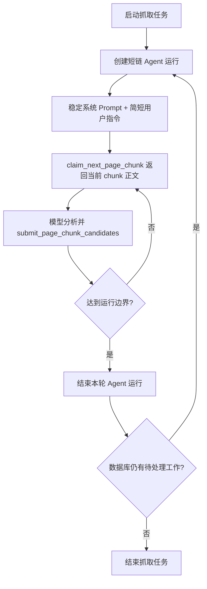

# 智能抓取上下文成本优化设计

## 背景

智能抓取使用 DeepAgents 封装多轮 LLM 调用：模型调用工具，工具返回页面或 chunk 内容，模型再基于追加后的上下文继续决策。DeepSeek 的上下文硬盘缓存会对完整匹配的输入前缀命中；因此，同一个 Agent 运行中随着历史追加，缓存命中 token 可能逐轮增加。

但缓存命中不等于免费。已处理 chunk 的正文如果继续保留在后续请求上下文中，即使成为 cached tokens，也仍会产生输入成本，并挤占上下文窗口。对于智能抓取，核心优化目标不是单纯提高缓存命中率，而是及时切断无价值历史，降低每个有效候选的 DeepSeek 成本。

## 目标

- 降低智能抓取的 DeepSeek 调用成本。
- 避免已处理页面正文和 chunk 内容在长链 Agent 会话中持续累积。
- 保留现有抓取能力、工具边界和候选保存逻辑。
- 使用现有 token 统计能力验证实际成本变化，而不是只看缓存命中 token 增长。

## 非目标

- 不引入多套 Agent 架构。
- 不优先优化抓取速度或并发吞吐。
- 不做额外缓存预热调用，避免为了命中缓存而新增成本。
- 不改变候选字段 schema、去重合并规则或详情页补全业务语义。

## 当前行为分析

当前抓取 Agent 在 `backend/app/agents/faculty_crawler_agent.py` 中创建。每次运行会新建 DeepAgents Agent，并通过 `StateBackend()` 管理单次运行状态。运行输入包含入口 URL、学校、学院和操作指令。

在单次运行内部，DeepAgents 会封装多轮对话。页面被切分后，`claim_next_page_chunk` 会把当前 chunk 的完整 `content` 返回给模型。模型提交候选后继续领取下一 chunk 或探索下一页面时，旧工具返回通常仍在对话历史中。这样可以提高后续请求对历史前缀的缓存命中，但也会让每轮输入越来越长。

因此，大任务中可能出现以下成本模式：

1. 第一个 chunk 正文首次进入上下文时属于缓存未命中。
2. 后续轮次继续携带第一个 chunk，可能命中缓存，但仍产生 cached input 成本。
3. 第二、第三个 chunk 依次进入历史，未命中成本和缓存成本共同增长。
4. 越到后面，单轮请求输入越长，即使命中率升高，单次调用费用也可能不理想。

## 设计原则

### 1. 缓存命中率不是唯一指标

DeepSeek KV Cache 对追加式多轮对话天然友好，但智能抓取的页面正文多为一次性材料。对于这类内容，应优先减少后续携带，而不是追求它们在后续轮次被缓存命中。

### 2. 稳定规则值得缓存，旧页面正文不一定值得缓存

系统 Prompt、工具说明、字段约束、chunk 提交规则属于稳定前缀，值得让 DeepSeek 缓存复用。已完成 chunk 的正文、候选临时分析、保存结果明细属于短期上下文，只应在完成当前决策前保留。

### 3. 用运行边界切断无价值历史

由于 DeepAgents 内部 messages 管理细节由框架封装，直接删除历史消息风险较高。更稳妥的方式是在后端运行时设置单次 Agent 运行边界：当处理一定数量 chunk、工具轮次或估算输入规模后，让本次 Agent 自然结束，再由现有任务运行时重新启动下一轮。

### 4. 保持恢复能力

运行边界必须依赖数据库中的 crawl job、page chunk、candidate 状态，而不是依赖 Agent 内存。重新启动后，Agent 应通过 `claim_next_page_chunk` 继续处理待处理 chunk，避免重复抓取入口页。

## 方案概述

本设计采用“短链 Agent 运行 + 稳定前缀复用”的方案。

### Agent 单次运行边界

为智能抓取增加可配置的单次运行上限。建议第一版支持以下任一边界触发结束：

- 已成功完成的 chunk 数达到阈值。
- Agent 工具调用轮次达到阈值。
- 估算输入 token 或 trace 中观测到的 token 使用达到阈值。
- 当前没有待处理 chunk，且没有明确新分页 URL 可探索。

第一版优先实现“完成 chunk 数上限”和“工具调用轮次上限”，因为它们可控、易测、不会依赖模型厂商返回格式。

### 重新调度方式

当单次 Agent 到达边界时，不把任务标记为完成，而是返回“本轮已达到上下文成本边界”。任务运行时检查数据库中是否仍存在待处理 chunk 或可继续探索的工作：

- 如果有待处理 chunk，启动新的 Agent 运行，并提示其直接 `claim_next_page_chunk`。
- 如果没有待处理 chunk，但 Agent 已明确发现新列表页，按现有工具流程继续探索。
- 如果没有剩余工作，正常结束抓取任务。

### Prompt 稳定化

保留当前单一抓取 Agent，不拆分多 Agent。整理 `FACULTY_CRAWLER_SYSTEM_PROMPT` 的结构，使稳定内容保持固定顺序：

1. 角色与目标。
2. 页面/chunk 处理流程。
3. 工具使用边界。
4. 候选字段与输出约束。
5. 禁止事项与错误恢复规则。

动态信息继续放在运行输入或工具返回中，不拼入系统 Prompt。这样新一轮 Agent 启动时，稳定前缀仍然容易命中 DeepSeek 缓存，而旧 chunk 正文不会继续累积。

### 工具返回瘦身

第一版不改变 `claim_next_page_chunk` 返回正文的事实，因为模型需要正文完成提取。但可以检查并收敛其他工具返回：

- `submit_page_chunk_candidates` 成功后只返回必要计数、状态和下一步指令。
- 避免把已保存候选的大段回显、重复正文或完整数据库对象放回工具结果。
- 错误结果保留可操作的修正指令，但避免重复携带过长上下文。

## 数据流

## 配置建议

新增或复用后端设置项，控制单次 Agent 运行的上下文成本边界：

- `crawler_agent_max_chunks_per_run`：每次 Agent 运行最多完成的 chunk 数，建议默认 1 到 3。
- `crawler_agent_max_tool_calls_per_run`：每次 Agent 运行最多工具调用次数，用于防止异常长链。

默认值应偏保守，优先降低成本和提升可控性。后续可根据实际 token 数据调整。

## 验证指标

优化效果应按“实际成本”验证，而不是只按缓存命中率验证。

建议观察：

- 智能抓取总 `input_tokens`。
- 智能抓取总 `cached_tokens`。
- 估算未缓存输入 token：`input_tokens - cached_tokens`。
- 单个成功候选的输入 token 成本。
- 单个成功候选的估算费用。
- 抓取成功候选数、重复候选数、失败 chunk 数。

预期结果：

- 大型抓取任务的总输入 token 增长速度下降。
- `cached_tokens / input_tokens` 不一定上升，但估算费用下降。
- 候选提取准确率和保存成功率不下降。

## 风险与缓解

### 风险：Agent 失去刚刚发现的分页 URL

如果分页 URL 只存在于 Agent 内存中，短链结束后可能丢失。

缓解方式：第一版运行边界只在完成 chunk 后触发，并优先依赖已入库 chunk 状态继续。对于新分页 URL，要求 Agent 在边界前完成当前决策；如后续发现需要跨轮保留新 URL，再设计显式的待访问 URL 队列。

### 风险：多次启动增加固定 Prompt 成本

短链运行会重复发送系统 Prompt 和工具定义。

缓解方式：这些内容高度稳定，适合 DeepSeek 前缀缓存；相比长期携带多个旧 chunk 正文，重复稳定前缀通常更可控。

### 风险：边界过小导致流程频繁中断

每个 chunk 都重启可能增加调度开销。

缓解方式：阈值做成配置，默认从 1 到 3 个 chunk 开始，通过 token 统计和成功率调整。

### 风险：框架内部仍保留超出预期的上下文

DeepAgents 内部 messages 结构可能和预期不同。

缓解方式：实现时通过 trace 和 token usage 观察单轮输入增长曲线，必要时增加更明确的结束条件或运行时循环控制。

## 分阶段实施建议

### 第一阶段：设计可观测性和边界

- 梳理当前 Agent 单次运行中 chunk 数、工具调用数、token 使用的记录方式。
- 增加单次运行边界配置。
- 在达到边界时让 Agent 本轮结束，并由任务运行时决定是否重启。

### 第二阶段：Prompt 稳定化

- 重排系统 Prompt，使稳定规则位于固定前缀。
- 移除重复或冲突描述。
- 保持动态任务信息只出现在用户输入或工具返回中。

### 第三阶段：工具返回瘦身

- 审查工具结果，删除不必要的大段回显。
- 保持错误恢复指令简短、稳定、可操作。

### 第四阶段：成本验证

- 对比优化前后同类抓取任务的 token 和候选结果。
- 重点评估估算费用、每候选成本和失败率。
- 根据数据调整默认 chunk/工具调用阈值。

## 验收标准

- 大型智能抓取任务不会在单次 Agent 运行中无限累积已处理 chunk 正文。
- 任务可在多次短链 Agent 运行之间连续处理待处理 chunk。
- 现有暂停、取消、恢复和候选保存逻辑保持可用。
- token 统计能显示优化前后的 `input_tokens`、`cached_tokens` 和估算未缓存输入变化。
- 抓取结果质量不低于优化前的同类任务。