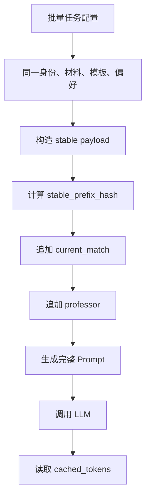

# 草稿模板改写 Prompt 缓存优化设计

## 背景

草稿模板改写是批量发送任务中的高频 LLM 调用。典型业务场景是：同一个用户身份、同一份默认材料、同一份套磁信模板和同一套改写偏好，同时对多个不同老师发起改写。

DeepSeek KV Cache 按请求输入前缀匹配缓存。要提高缓存命中率，Prompt 应按「跨请求不变概率」排序：最不可能变化的内容放在最前面，越可能变化的内容越靠后。这样同一批次中不同老师的改写请求可以复用更长的公共前缀。

本设计只调整 Prompt 组织方式，不删除业务上下文，不改变模型任务目标，不改变输出结构。功能效果不变是硬约束。

## 目标

- 在不改变草稿模板改写效果的前提下，提高 DeepSeek KV Cache 命中率。
- 让 Prompt 的稳定前缀和动态后缀在代码中显式可见，降低后续维护时误破坏缓存结构的风险。
- 为后续统计分析提供可观测信号，能够判断同一批次是否复用了相同稳定前缀。
- 保持现有 OpenAI Prompt Cache 行为兼容，不依赖 DeepSeek 不支持的专有请求参数。

## 非目标

- 不压缩、摘要或删减学生材料、模板内容、匹配结果、老师信息。
- 不改变 LLM 请求接口、模型选择、温度、最大输出 Token 等运行参数。
- 不调整批量任务调度顺序；调度层优化可以作为后续独立设计。
- 不为 `prompt_cache_miss_tokens` 新增数据库字段。

## 当前问题

当前模板改写 Prompt 由 `build_draft_rewrite_prompt()` 构造，整体已经接近缓存友好的顺序，但存在以下问题：

- **业务排序原则没有显式建模：** 代码依赖 Python 字典插入顺序来维持字段顺序，缺少稳定前缀与动态后缀的明确边界。
- **老师相关内容缺少边界保护：** `current_match` 和 `professor` 都是老师相关动态内容，应作为最后的动态块，避免未来维护时被插入到稳定内容之前。
- **缺少稳定前缀观测：** 匹配分析已有 `stable_prefix_hash`，模板改写没有类似字段，难以判断缓存未命中是供应商策略问题，还是请求前缀发生了变化。
- **测试没有锁定缓存顺序：** 现有测试覆盖了功能输出和部分缓存 Key，但没有断言 `source_blocks`、`current_match`、`professor` 的相对顺序。

## 变化概率排序

结合批量模板改写业务，同一批次内字段变化概率如下。

| 顺序 | 内容 | 变化概率 | 原因 |
| --- | --- | --- | --- |
| 1 | 系统消息 `SYSTEM_DRAFT_REWRITE_PROMPT` | 极低 | 固定任务角色和全局要求。 |
| 2 | `instructions` | 极低 | 固定改写规则。 |
| 3 | `response_schema` | 极低 | 固定输出结构。 |
| 4 | `rewrite_preferences` | 低 | 同一批次通常使用同一套改写偏好。 |
| 5 | `user_custom_instruction` | 低 | 同一批次通常来自同一次任务配置。 |
| 6 | `student_material_text` | 低 | 同一用户身份和默认材料在批次内不变。 |
| 7 | `available_materials` | 低 | 同一身份的材料清单在批次内不变。 |
| 8 | `source_blocks` | 低 | 同一份模板对多个老师复用。 |
| 9 | `current_match` | 高 | 匹配结果按老师变化。 |
| 10 | `professor` | 最高 | 批量任务中每个请求对应不同老师。 |

## 目标 Prompt 结构

模板改写 Prompt 应拆成两个逻辑部分。

### 稳定前缀

稳定前缀包含同一批次中应保持一致的内容：

```text
instructions
response_schema
input.rewrite_preferences
input.user_custom_instruction
input.student_material_text
input.available_materials
input.source_blocks
```

稳定前缀不得包含以下老师相关字段：

```text
current_match
professor.name
professor.email
professor.title
professor.research_direction
professor.recent_papers
professor.profile_url
```

### 动态后缀

动态后缀包含每个老师不同的内容，固定放在 Prompt 末尾：

```text
input.current_match
input.professor
```

`current_match` 必须位于 `professor` 之前。原因是 `current_match` 是对当前老师的分析结果，语义上是老师信息的补充上下文；把二者连续放在最后，可以让稳定前缀尽可能延伸到模板内容结束。

## 设计方案

### 1. 引入草稿改写 Prompt Parts

新增内部数据结构，表达模板改写 Prompt 的稳定前缀和动态后缀：

```python
@dataclass(slots=True)
class DraftRewritePromptParts:
    prompt: str
    stable_prefix: str
    prompt_hash: str
    stable_prefix_hash: str
    prompt_cache_key: str | None = None
```

保留现有 `build_draft_rewrite_prompt()` 作为兼容包装，内部调用新的 `build_draft_rewrite_prompt_parts()` 并返回 `parts.prompt`。

### 2. 显式构造稳定前缀

`build_draft_rewrite_prompt_parts()` 先构造稳定 payload：

```json
{
  "instructions": [],
  "response_schema": {},
  "input": {
    "rewrite_preferences": {},
    "user_custom_instruction": {},
    "student_material_text": "...",
    "available_materials": [],
    "source_blocks": []
  }
}
```

构造时继续沿用现有字段值、字段名和 JSON 序列化格式，避免模型行为变化。空的 `rewrite_preferences` 和 `user_custom_instruction` 仍按现有逻辑删除。

### 3. 显式追加动态后缀

在稳定 payload 的 `input` 末尾依次追加：

```json
{
  "current_match": {},
  "professor": {}
}
```

当 `current_match` 为空时不输出该字段，但 `professor` 仍保持最后一个字段。

### 4. 记录稳定前缀 Hash

模板改写生成结果新增内部元数据：

- `prompt_hash`：完整 Prompt 的 SHA-256。
- `stable_prefix_hash`：稳定前缀的 SHA-256。
- `prompt_cache_key`：保持现有 OpenAI 官方 Profile 下的 Key 逻辑。

第一阶段可以只在运行时对象和测试中保留这些字段，不强制新增数据库字段。若后续需要在用量中心分析草稿改写缓存效果，再单独设计持久化方案。

### 5. 保持请求语义不变

LLM 请求仍保持两条消息：

```text
system: SYSTEM_DRAFT_REWRITE_PROMPT
user: 完整 JSON Prompt
```

不改变：

- `temperature`
- `max_tokens`
- 输出 schema
- 模板块序列化方式
- 材料截断规则
- 老师信息字段内容
- 匹配结果字段内容

## 数据流



## 测试要求

### 单元测试

- `build_draft_rewrite_prompt_parts()` 应返回完整 Prompt、稳定前缀 Hash 和完整 Prompt Hash。
- 稳定前缀必须包含 `source_blocks`。
- 稳定前缀不得包含老师姓名、邮箱、研究方向、论文、主页等字段值。
- 完整 Prompt 中 `source_blocks` 必须早于 `current_match`。
- 完整 Prompt 中 `current_match` 必须早于 `professor`。
- 当 `current_match` 为空时，`professor` 仍必须位于完整 Prompt 末尾的动态区域。
- 现有 `build_draft_rewrite_prompt()` 的返回内容应与新 `parts.prompt` 一致。

### 回归测试

- 现有草稿模板改写测试必须继续通过。
- 现有 `prompt_cache_key` 测试必须继续通过。
- 现有 DeepSeek `cached_tokens` 解析测试必须继续通过。

## 验收标准

- 同一身份、同一材料、同一模板、同一偏好、不同老师的模板改写请求拥有相同 `stable_prefix_hash`。
- 不同老师的信息只出现在动态后缀中。
- 完整 Prompt 的字段顺序符合变化概率排序。
- 所有相关后端单元测试通过。
- 用户可观察到 `cached_tokens` 统计继续正常记录。

## 风险与缓解

| 风险 | 影响 | 缓解 |
| --- | --- | --- |
| JSON 结构变化影响模型输出 | 可能改变改写质量 | 保持字段名、字段值、序列化格式不变，只显式固定顺序。 |
| 后续维护破坏字段顺序 | 降低缓存命中率 | 用单元测试锁定关键字段顺序和稳定前缀内容。 |
| 稳定前缀 Hash 未持久化 | 难以长期分析 | 第一阶段先保证运行时可计算；持久化作为后续独立需求。 |
| DeepSeek 缓存尽力而为 | 命中率不一定 100% | 通过连续批量请求和稳定前缀最大化命中概率，不把命中作为功能正确性前提。 |

## 后续扩展

- 批量任务调度可按 `(llm_profile_id, identity_id, primary_material_id, template_id, rewrite_preferences_hash)` 分组连续执行，提高公共前缀落盘后的复用概率。
- 用量中心可增加草稿改写的稳定前缀维度分析，定位低命中批次。
- 非模板草稿生成路径可复用同一 Prompt Parts 模式，但需要单独分析模板正文和匹配信息的变化概率。