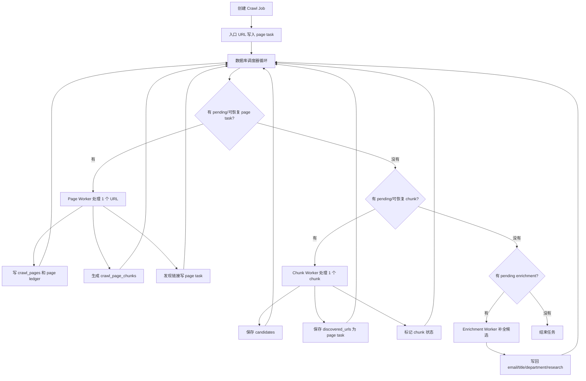

# 智能抓取 Runtime V2 数据库调度器设计

## 背景

现有智能抓取以完整 Agent 为主线。Agent 在同一段对话中负责抓页面、处理 chunk、保存候选、发现新页面和判断结束。这个模式能工作，但随着页面和 chunk 增多，对话历史和工具结果会不断累积，导致单次请求 prompt 变长。最近测试显示，即使 DeepSeek 缓存命中率较高，总 token 仍然很大，且调试时需要从长 Agent trace 中推断流程。

我们已经实现了页面抓取账本，证明“数据库作为任务事实来源”是正确方向。下一步不再继续修补 v1，而是全面切到 Runtime V2：数据库调度器 + 多个短生命周期 Worker。

## 决策

本次重写全面切到 Runtime V2。V1 设计和代码先保留，但主流程不再使用 V1 完整抓取 Agent。

保留 V1 的目的：

- 便于回看旧逻辑；
- 便于必要时手动对照排查；
- 降低一次性删除造成的回滚风险。

但 Runtime V2 上线后，新建抓取任务默认走 V2，不再通过 V1 完整 Agent 连续处理全流程。

## 不可违背原则

所有节省 token 的优化都必须服从以下原则：不能对正常功能流程造成任何风险或负面影响。

因此 V2 的核心不是“少做事”，而是“每次只做一个明确任务，并把结果可靠写入数据库”。任何页面、chunk、候选、补全、失败和跳过原因都必须有数据库记录，不能依赖 Worker 的聊天历史。

## 目标

1. 用数据库调度器替代完整抓取 Agent 的主流程控制。
2. 用短生命周期 Worker 分别处理页面、chunk 和候选补全。
3. 所有 Worker 每次只处理一个明确工作项，结束后不保留上下文。
4. 新页面 URL、候选导师、补全结果、失败原因都落库。
5. 调度器只基于数据库状态推进任务。
6. 降低 token 历史累积，同时保持或提升候选覆盖率和字段完整度。
7. 保留暂停、取消、重试、部分完成、审核等现有产品语义。

## 非目标

- 不在本次直接删除 V1 代码。
- 不降低候选字段 schema 和保存校验要求。
- 不跳过详情补全。
- 不引入内存队列作为任务事实来源。
- 不做跨任务全局 URL 黑名单。
- 不把外部站点的不可访问问题伪装为成功。

## 总体架构

Runtime V2 由四部分组成：

1. 数据库调度器；
2. Page Worker；
3. Chunk Worker；
4. Enrichment Worker。

## 调度优先级

调度器保持单实例决策，但可以按 Worker 并发配额领取多个工作项执行。调度不能无上限地偏向某一类工作，否则会造成 chunk 或补全长期饥饿。采用“优先级 + 公平预算 + 并发配额”的调度：

1. 可恢复的过期 processing 工作项；
2. pending page task，但连续处理 page task 不超过配置预算；
3. pending chunk；
4. pending enrichment；
5. 可恢复失败重试；
6. 结束任务。

页面优先于 chunk 的原因：入口页和已发现页面需要先形成 chunk 队列，避免只处理局部列表后就误以为任务完成。但 page task 不能无限优先。默认每连续处理 3 个 page task 后，如果存在 pending chunk，则至少处理 1 个 chunk。

Chunk Worker 提交 discovered_urls 后，调度器后续调度会重新看到 page task；公平预算保证新页面能继续抓，也保证已生成 chunk 不会长期积压。

## 并发策略

V2 支持 Worker 并发，但默认必须保守开启。并发只用于降低等待时间，不能为了提速影响正常抓取覆盖率、去重、重试或任务结束判断。

默认策略：

- 调度器保持单实例决策，只由它根据数据库状态分配工作项。
- Enrichment Worker 默认允许并发，但每个 Worker 只处理 1 个候选，并通过候选补全任务的 lease 防止同一候选被重复补全。
- Page Worker 允许小并发，但必须按任务和同域限流。默认同一抓取任务最多 2 个 Page Worker，同一域名最多 2 个 Page Worker。
- Chunk Worker 按可并发架构设计，但默认并发数为 1，运行效果等同串行。只有在候选合并、URL 入队和 `complete_current_chunk` 事务幂等经测试证明稳定后，才能通过显式配置把并发数调大。

并发安全边界：

- 同一个 normalized_url 不能被多个 Page Worker 同时处理。
- 同一个候选不能被多个 Enrichment Worker 同时补全。
- 同一个 chunk 不能被多个 Chunk Worker 同时处理，领取 chunk 必须依赖状态条件更新和 lease。
- Chunk Worker 并发时，候选合并必须依赖 identity_key、email、profile_url 等唯一性和幂等合并逻辑，不能靠模型判断去重。
- Chunk Worker 并发时，discovered_urls 入队必须依赖 normalized_url 唯一约束和幂等 upsert，不能因为两个 chunk 同时发现同一 URL 而重复抓取。
- 任务结束判断只能由调度器在确认没有 pending、processing 和 retryable 工作项后执行。
- 如果并发限制与功能完整性冲突，必须降低并发或回到串行，不能跳过正常工作项。

## 数据库状态模型

### Crawl Job

继续使用 `crawl_jobs` 和 `crawl_job_runs`，并新增运行字段记录：

- runtime_version：`v2`；
- current_worker_kind；
- last_scheduler_reason；
- token 汇总；
- 失败/跳过统计。

`runtime_version` 必须是数据库字段，不能只写入 trace 或 operation log。trace 和 operation log 只用于调试展示，不能作为调度判断依据。

### Page Task

新增页面任务表，命名为 `crawl_page_tasks`。

字段：

- id；
- job_id；
- url；
- normalized_url；
- parent_url；
- source_kind：entry、page_link、chunk_discovery、manual；
- source_page_id；
- source_chunk_id；
- status：pending、processing、fetched、skipped、failed_retryable、failed_terminal；
- reason；
- priority；
- attempt_count；
- worker_id；
- claimed_at；
- lease_expires_at；
- last_error；
- created_at；
- updated_at。

约束：

- `job_id + normalized_url` 唯一；
- 同一个任务内同一 URL 不重复入队；
- Page Ledger 中已完成处理、已抓取且无需再处理、或 terminal_failed 的 URL 不能重新入队；
- skipped 和 failed_terminal 必须记录 reason；
- processing 必须有 claimed_at/lease_expires_at，用于恢复崩溃或卡死 worker；
- lease 未过期的 processing 不应被其他 worker 抢占；lease 过期后才按可恢复 processing 处理。

### Page Ledger

继续使用 `crawl_page_fetch_states` 作为页面是否可抓取的账本。

Page Task 负责“待办队列”，Page Ledger 负责“页面抓取事实”。二者不要混用：

- Page Task 回答：这个 URL 是否还有待处理任务；
- Page Ledger 回答：这个 URL 抓取结果是什么，是否还能再抓。

### Page Chunk

继续使用 `crawl_page_chunks`。状态需要支持：

- pending；
- processing；
- completed；
- no_candidates；
- split_required；
- superseded；
- failed_retryable；
- failed_terminal。

如不新增枚举，也必须在现有状态上表达 retryable/terminal 的差异，不能让失败 chunk 静默消失。

### Candidate / Enrichment

继续使用 `crawl_candidates` 保存候选事实，新增独立补全任务表 `crawl_candidate_enrichment_tasks` 作为调度队列。

字段：

- id；
- job_id；
- candidate_id；
- status：pending、processing、completed、unchanged、skipped_no_profile、not_needed、failed_retryable、failed_terminal；
- attempt_count；
- worker_id；
- claimed_at；
- lease_expires_at；
- last_error；
- enriched_at；
- created_at；
- updated_at。

`crawl_candidates` 只保存候选字段和审核状态；补全是否待处理、是否失败、是否跳过由 `crawl_candidate_enrichment_tasks` 判断。没有 profile_url、字段已经完整或明确不需要补全的候选，必须标记为 skipped_no_profile 或 not_needed，不能一直停留在 pending。

## Page Worker

Page Worker 每次只处理一个 page task。

输入：

- job_id；
- page_task_id；
- url；
- parent_url；
- 学校；
- 学院；
- source_kind；
- 抓取规则。

职责：

1. 检查任务是否暂停/取消。
2. 查 Page Ledger，跳过已完成处理、无需再处理或 terminal_failed 的 URL。
3. 执行 URL 安全校验。
4. HTTP 抓取，必要时 browser fallback。
5. 写 `crawl_pages`。
6. 更新 Page Ledger。
7. 成功页面生成 chunks。
8. 从页面中提取候选页面链接，写入 `crawl_page_tasks`。
9. 更新当前 page task 状态。

Page Worker 不负责保存导师候选。候选保存只发生在 Chunk Worker 或 Enrichment Worker 中。

抓取路径选择规则：

- Page Worker 默认先走 direct fetch，直接用 HTTP 获取页面内容、标题和链接。
- direct fetch 成功拿到有效正文和链接时，不启动浏览器。
- 只有 direct fetch 结果不可用时，才启动 browser fallback。
- browser fallback 的触发条件包括：HTTP 状态码为 403、429 或 5xx；正文为空或明显过短；页面只有 JS 空壳；出现验证码、访问受限、反爬提示；命中已知必须浏览器渲染的域名或路径规则。
- 同一个 page task 的 browser fallback 最多执行 1 次，不能为了节省成本无限降级，也不能为了节省资源跳过必要 fallback。
- Page Worker 必须记录实际抓取路径和 fallback 原因，包括 `fetch_mode`、`direct_status`、`fallback_reason`、`browser_status`。
- direct fetch 优先是资源优化；browser fallback 是功能兜底。任何节省资源的策略都不能导致原本可通过浏览器获取的页面被直接放弃。

链接发现规则：

- 优先通过确定性规则提取页面 links；
- 只保留同域或允许规则内链接；
- 按锚文本、URL、上下文过滤明显无关链接；
- 必要时使用短链 LLM 对当前页面链接做分类；
- 低置信度链接必须记录为 skipped 或进入人工复核，不能静默丢弃有明确导师语义的链接。

## Chunk Worker

Chunk Worker 每次只处理一个 chunk。系统架构必须支持多个 Chunk Worker 同时处理不同 chunk，但默认并发数为 1，等同串行执行。

这样设计的目的不是现在立刻提速，而是先把并发所需的稳定边界做好：chunk 领取、候选合并、URL 入队和状态更新都必须天然幂等。未来只有在测试证明这些边界稳定后，才能提高 Chunk Worker 并发数。

Chunk Worker 并发设计规则：

- 每个 chunk 只能被一个 Worker 领取，领取必须通过数据库状态条件更新完成，例如从 pending/retryable 原子更新为 processing，并写入 worker_id、claimed_at 和 lease_expires_at。
- `complete_current_chunk` 必须校验 chunk_id 属于当前 Worker 且 lease 未过期，防止过期 Worker 回写旧结果。
- 候选保存必须使用后端确定性合并规则，不能依赖 Worker 之间共享记忆。
- discovered_urls 入队必须使用 normalized_url 去重和幂等 upsert，多个 chunk 同时发现同一 URL 时只能产生一个 page task。
- chunk 完成必须以数据库事务为准，不能因为模型说“处理完了”就直接信任。

输入：

- job_id；
- chunk_id；
- source_url；
- chunk_index；
- 当前 chunk 正文；
- 学校；
- 学院；
- 候选 schema；
- URL 发现 schema；
- 保存规则。

Chunk Worker 只暴露一个工具：`complete_current_chunk`。

不暴露：

- crawl_page；
- investigate_with_browser；
- claim_next_page_chunk；
- submit_page_chunk_candidates；
- submit_discovered_urls；
- 文件工具；
- 子 Agent 工具。

`complete_current_chunk` 的语义是：当前 chunk 的完整处理结果。

参数：

- chunk_id；
- chunk_status：completed、no_candidates、too_many_candidates；
- candidates；
- discovered_urls；
- has_unsubmitted_candidates_in_current_chunk。

后端在一个受控流程中：

1. 校验 chunk_id 是否为当前 worker 领取且 lease 未过期的 chunk。
2. 校验 candidates。
3. 保存或合并 candidates。
4. 校验 discovered_urls。
5. 写入合法 discovered_urls 对应的 page task。
6. 标记 chunk 状态。
7. 返回结构化结果。

候选保存失败和 URL 保存失败的处理：

- 候选字段非法：chunk 不完成，允许修正后重试；
- URL 非法：合法 URL 入库，非法 URL 返回 rejected_discovered_urls，不能导致候选保存失败；
- 数据库事务失败：候选、合法 URL 和 chunk 状态整体回滚，chunk 保持可重试状态；
- 为避免“候选已保存但 URL 丢失”或“URL 已入队但 chunk 未完成”，候选保存、合法 URL 入队和 chunk 状态更新必须在同一个数据库事务内完成；非法 URL 的 rejected 结果不参与回滚。
- 模型未调用工具：chunk 保持 processing 或 retryable，按预算重试。

## Enrichment Worker

Enrichment Worker 每次处理一个候选。一个候选一个 Worker，便于失败隔离和 token 统计。

输入：

- candidate_id；
- name；
- profile_url；
- 当前已有字段；
- 学校；
- 学院；
- 补全字段 schema。

职责：

1. 抓取候选个人主页；
2. 提取邮箱、职称、部门、研究方向、近期论文等字段；
3. 写回 `crawl_candidates`；
4. 更新 enrichment 状态；
5. 记录 unchanged 或 failed 原因。

Enrichment Worker 不发现列表页，不保存新候选，不改变 page/chunk 状态。

## 完成判断

调度器只有在以下条件同时满足时才能结束任务：

1. 没有 pending、failed_retryable 或 lease 已过期的 processing page task；
2. 没有 pending、failed_retryable 或 lease 已过期的 processing chunk；
3. 没有 pending、failed_retryable 或 lease 已过期的 processing enrichment；
4. 没有处于可恢复重试窗口内的 page/chunk/enrichment 失败；
5. 任务未暂停或取消；
6. 页面账本没有需要继续处理的 chunked/succeeded-but-not-chunked 页面；
7. 已有候选数量和失败状态足以决定最终任务状态。

最终状态规则：

- 有候选且无阻塞失败：needs_review；
- 有候选但存在 terminal failed 工作项：partially_completed；
- 无候选且全部页面失败或无有效内容：failed；
- 用户取消：canceled；
- 用户暂停：paused。

## 重试与失败预算

所有工作项都必须有 attempt_count、last_error 和 worker lease。lease 用于区分“正在被正常 worker 处理”和“worker 崩溃后遗留的 processing”。

默认初始预算：

- page task：临时失败最多 2 次；
- chunk：模型/校验失败最多 2 次；
- enrichment：临时失败最多 2 次。

终止失败必须记录 reason。可恢复失败不能被永久跳过，除非达到预算上限。

## 暂停与取消

每个 Worker 在以下位置检查任务状态：

- 开始前；
- 外部抓取前；
- LLM 调用前；
- 写数据库前；
- 完成后。

暂停时保留当前状态。恢复时，lease 未过期的 processing 可等待原 worker 完成；lease 已过期的 processing 才能重新领取或按 attempt_count 重试。

取消时停止新调度，不再启动 Worker；正在执行的 Worker 在安全点退出。

## Token 记录

V2 必须能回答 token 花在哪里。

必须按 worker 记录：

- worker_kind：page、chunk、enrichment；
- work_item_id；
- model；
- input_tokens；
- output_tokens；
- cached_tokens；
- total_tokens；
- duration_ms；
- status；
- error_kind。

这样用于区分：页面链接分类、chunk 候选提取、候选详情补全分别花了多少 token。

## V1 保留但不使用

V1 代码保留，不在新任务主流程中使用。

实施要求：

- 新建任务默认 runtime_version 为 v2；
- 调度入口调用 V2 runtime；
- V1 入口不再被 worker manager 自动调用；
- V1 测试保留，避免误删依赖；
- V2 测试覆盖新主流程。

手动回退只能通过显式开发配置或调试入口触发，并必须记录到日志；产品默认路径始终是 V2。

## 迁移策略

新任务走 V2。已有运行中的 V1 任务不强制迁移，避免中途状态不一致。

规则：

- queued 新任务：走 V2；
- running V1 任务：不进入 V2 调度器；继续按已有恢复逻辑处理，或标记为需要用户重启；
- paused V1 任务：恢复时不自动混入 V2，可提示用户重新创建任务，或提供一次性迁移脚本；
- 历史数据只读展示，不强制回填 V2 队列表。

## 测试要求

必须覆盖：

1. 新建任务入口 URL 写入 page task。
2. 调度器优先处理 page task。
3. Page Worker 成功抓页后生成 chunks。
4. Page Worker 发现同域教师相关链接后写入 page task。
5. Page Worker 不重复入队已完成处理、无需再处理或 terminal_failed 的 URL。
6. 有 pending chunk 时 Chunk Worker 处理一个 chunk 后立即结束。
7. Chunk Worker 只能调用 `complete_current_chunk`。
8. `complete_current_chunk` 同时保存 candidates 和 discovered_urls。
9. 非法 discovered URL 被 rejected，不影响合法候选保存。
10. 调度器能继续处理 Chunk Worker 发现的新 page task。
11. Enrichment Worker 能补全候选并写回状态。
12. 失败工作项按预算重试，超过预算后进入 failed_terminal 或 partial。
13. 暂停/取消不会继续启动新 Worker。
14. 没有任何 pending/retryable work 时任务进入正确最终状态。
15. token 记录能按 worker_kind 聚合。
16. V1 自动调度入口不再处理新任务。
17. 并发领取不会让同一 normalized_url、同一 chunk 或同一候选被多个 Worker 同时处理。

## 成功标准

- 同等测试任务下，候选数量不低于 V1。
- 关键字段完整度不低于 V1。
- 页面不重复抓取。
- chunk 不漏处理。
- Chunk 中发现的新 URL 不丢失。
- 单次 LLM prompt 不随已处理页面/chunk 数量线性增长。
- token 可按 worker 拆分统计。
- 任务状态正确进入 needs_review、partially_completed、failed、canceled 或 paused。
- 后端相关测试通过。

## 风险与缓解

### 风险：调度器状态机复杂度上升

缓解：所有工作项都用明确状态、attempt_count 和 worker lease；调度器单实例决策，并按 Worker 并发配额领取工作项；用测试覆盖状态流转和并发领取。

### 风险：page task 过多导致 chunk 或补全饥饿

缓解：采用优先级 + 公平预算。page task 仍优先，但连续 page task 达到预算后，必须处理已存在的 pending chunk，避免候选迟迟不入库。

### 风险：Page Worker 链接分类漏掉重要页面

缓解：规则过滤优先保守保留教师相关链接；LLM 分类只处理当前页面链接；低置信度链接记录 skipped reason，不静默丢弃。

### 风险：Chunk Worker 无历史导致漏跨页线索

缓解：Chunk Worker 必须通过 `complete_current_chunk` 提交 discovered_urls，后端持久化为 page task；跨 chunk/跨页线索由数据库队列传递。

### 风险：候选重复增加

缓解：沿用现有候选 identity_key、email、profile_url 去重和合并逻辑；保存结果返回 merged/skipped 统计。

### 风险：全面切 V2 影响现有功能

缓解：V1 代码保留；V2 独立 runtime；新任务默认 V2；显式开发配置或调试入口可用于人工回退，产品默认路径不自动回退。

## 结论

Runtime V2 的目标是把智能抓取从“长对话 Agent”改为“数据库调度的短任务流水线”。

完整 Agent 不再是主流程。页面、chunk、补全分别由短生命周期 Worker 处理。所有结果写数据库，所有下一步由调度器基于数据库决定。这样既能显著降低历史 token 累积，又能保证页面发现、候选保存、详情补全和任务结束不依赖模型记忆。
